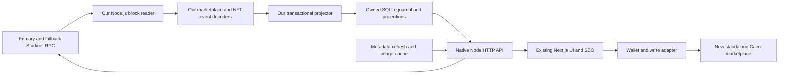

# Owned marketplace backend — working scope

[BUILD-PLAN.md](./BUILD-PLAN.md) owns launch scope and delivery gates. This document supplies the indexing/API design, including collection offers, trader management, analytics, in-product notifications and reporting.

Version: 0.4 · 6 October 2026

Status: architecture proposal for review; not a deployment authorization or a claim of operational readiness.

OpenSea is the product benchmark. The [coverage assessment](./OPENSEA-COVERAGE.md) is background rationale; consult the build plan for the current launch boundary.

## 1. Outcome and decisions

Keep the current marketplace UI. Give it a backend we operate that can reconstruct marketplace state from Starknet and serve every product read without Cartridge-hosted Torii or image endpoints.

| Decision | Status |
| --- | --- |
| Retain existing UI, routes and visual design | Confirmed by user |
| Design backend and implementation scope before building | Confirmed by user |
| New standalone Cairo marketplace contracts; no Dojo World | Confirmed by user; see [contract scope](./CONTRACT-SCOPE.md) |
| On-chain orders; ERC-721 listings, token-specific offers, atomic cart | Confirmed by user |
| One-shot collection offers, trader management, analytics, inbox and reports | Full launch target defined by the build plan |
| Preserve existing wallet integrations | Proposed integration default |
| Own the API, data storage, indexing operations, metadata delivery and recovery process | Design objective |
| Build our own indexer; do not use Torii | Confirmed by user; supersedes the previous recommendation |
| Node.js backend | Accepted by user |
| No third-party runtime packages in the new backend | Conservative interpretation of “no deps”; standard Node modules only |
| Launch with the Realms ERC-721 collection only | Confirmed 8 October 2026; other collections and permissionless onboarding deferred |
| Native Node HTTP API, independently deployable beside the Next.js frontend | Proposed default; no Fastify, Arcade SDK, Dojo SDK or indexing framework |
| Railway staging and production; persistent SQLite volume per environment | Confirmed 8 October 2026; API/indexer/metadata processes share one backend service |

The October [current-state assessment](./INDEXER-CURRENT-STATE-2026-10-06.md) remains the historical inventory. Its Torii recommendation is superseded by the user's custom-indexer decision. PR #92 is a source of requirements and selected fixtures/interface ideas; its indexing implementation is excluded. This scope does not silently convert the prior branch's “accepted” ADR into user approval.

The user selected replacement contracts after the [contract assessment](./CONTRACT-ASSESSMENT-2026-10-06.md). The [accepted architecture decision](./adr/0001-standalone-cairo-marketplace.md) fixes the direction; [contract scope](./CONTRACT-SCOPE.md) defines the proposed economic terms, ABI and events. The new-market backend has no Dojo decoder. Legacy history or cancellation support is separately bounded migration work.

### Dependency contract

The backend owns RPC acquisition, event/model decoding, projections, checkpoints, metadata jobs, API validation and operational commands. No Torii executable, Dojo/Cartridge indexing SDK, hosted NFT API, external indexer framework or vendor-specific database schema is part of its execution path.

Use Node built-ins: `fetch`/`AbortController` for JSON-RPC, `node:http` for the API, `node:sqlite` for storage, `node:fs` for local assets, `node:crypto` for ordinary content hashes, and `node:test`/`node:assert` for backend tests. JavaScript ESM with JSDoc types is the zero-build starting point; TypeScript can remain development tooling if desired. The existing frontend's dependencies remain unchanged by this backend constraint.

Starknet RPC and token metadata origins are still external data sources. “No deps” does not eliminate the need for chain access, disk, a Node runtime or hosting. Keep RPC provider URLs configurable. Versioned ABI/schema/selector fixtures are data checked into our repository, not runtime vendor packages. Any later package addition is a scope change, not an implicit exception.

## 2. Release boundary

### Required for the first production release

- Mainnet indexing for approved collections and the new marketplace deployment; Sepolia for a complete transaction lifecycle test.
- Collection discovery, tokens, ownership/holdings, traits, full-collection filtering and sorting, listings, offers, market activity and per-currency summaries.
- Metadata and image delivery on owned endpoints, including dynamic game metadata refresh and explicit missing-data states.
- Checkout preflight for the existing single-currency, maximum-25-item, atomic cart.
- Chain-aware configuration, server-side SEO reads, index freshness, transaction convergence and operational diagnostics.
- Repeatable historical replay, checkpoint recovery, backups, tested restore, RPC failure handling and documented cutover.
- A frontend data adapter and the workflows defined in the build plan: bulk seller actions, trader dashboard, search/analytics, notifications and reporting.
- Durable authenticated application data for notifications, reports and verification decisions, separate from replayable chain state.

### Deferred

Off-chain signed orders; trait offers; ERC-1155/partial fills; auctions; custodial accounts; server signing; relayers; fiat conversion; cross-chain trading; richer social profiles/watchlists; email/push notifications; permissionless collection onboarding; a new visual design; removal of Controller/Ready/Braavos; operating a Starknet full node. In-product authentication/inbox and per-currency marketplace analytics are launch work.

The initial collection is Realms only, confirmed 8 October 2026. Use
`config/marketplace/registry.realms.json` as the indexing baseline and validate
its configured address/start block, contract class, event layouts, metadata and
transfer/royalty behavior against chain evidence. The broader `registry.json`
remains a development candidate inventory, not the initial deployment allowlist.
Season Pass, Loot Chests, Cosmetics, Golden Token, Beasts and Adventurers are
follow-up onboarding work. v1 trading remains ERC-721 with quantity one.

Portfolio scope is holdings of registered collections, not every NFT on Starknet. Historical/legacy collections may be retained in internal evidence but excluded from discovery using explicit registry policy; never infer replacement collections from similar names.

## 3. Architecture



Start with one backend codebase: a writer process per chain, an API process and a metadata fetch process. Metadata results enter a bounded queue for the single database writer. Networking can run concurrently, but projection commits follow canonical chain order. Do not introduce Kafka, Redis, Elasticsearch or an external queue.

**Storage recommendation:** one owned SQLite database per chain on local persistent disk, using Node's built-in driver, WAL mode, foreign keys, explicit migrations and prepared statements. Store both the raw event journal and query projections. Keep HTTP database reads in a bounded worker pool so synchronous SQL does not block request handling. Pin and test the selected Node release: the current official documentation labels `node:sqlite` release candidate, so do not assume stable-driver guarantees across versions.

The initial topology colocates writer and read workers with the database on one host. Do not share a writable SQLite file across a network filesystem or claim multi-host database availability. Back up consistent database snapshots and versioned asset files off-host using deployment tooling. PostgreSQL or a native third-party driver would be a later explicit change if measurements show this design cannot meet requirements; do not write a database protocol/driver to preserve an arbitrary package count.

Only the API is public. Database files, admin operations and RPC credentials remain private. Browser and Next.js server code share the same versioned interface. A same-origin browser path can proxy the API; the long-running indexer does not run inside a Next.js request or serverless function.

### Modules and responsibility

| Module | Interface presented to callers | Complexity hidden inside |
| --- | --- | --- |
| Registry | Resolve network, collection, currency and product policy | Address normalization, verified start blocks, versions, capability flags |
| Chain ingestion | Read indexed state with progress/provenance; replay and reconcile | Marketplace lifecycle events, NFT transfers, canonical chain handling, checkpointing |
| Catalog | Query collections, tokens, traits and holdings | Metadata normalization, eligibility rules, filtering, sorting, pagination |
| Market | Query orders, activity, summaries and deployment configuration | Order transitions, expiry, currency separation, provenance and aggregates |
| Checkout | Evaluate a cart for a buyer | Indexed terms, freshness, direct-chain checks, fees, per-row failures |
| Assets | Resolve versioned media and refresh metadata | URI resolution, fetch limits, retries, cache invalidation and failure tracking |

These are modules within the backend, not six mandatory microservices. Keep SQL in the storage module and decoding independent of network/database access. Tests exercise the product interfaces against fixtures and replayed state.

## 4. Data ownership and invariants

The chain is authoritative for orders, ownership, balances, approvals, pause and settlement. The registry is authoritative for which collections/currencies the product supports. Token metadata is descriptive source material, not proof of ownership or contract permission to transfer.

| Record | Identity | Required information |
| --- | --- | --- |
| Collection | chain + contract address | Standard, start block, name, visibility, supported filters/sorts, metadata/eligibility policy |
| Token | chain + collection + uint256 token ID | Mint/burn state, ownership, normalized metadata, metadata status/version |
| Holding | chain + collection + token ID + account | Exact balance and update provenance |
| Order | chain + marketplace + maker + maker nonce | Kind, state, collection and optional token, buyer debit, fixed payouts or bounded collection-offer royalty policy, expiry and provenance |
| Marketplace configuration | chain + marketplace address | ABI/deployment version, fee settings, pause and asset policy with provenance |
| Activity | chain + transaction + event index + deterministic subrecord key | Event/model-change type, associated order/token, position and source |
| Metadata | token/collection identity + content version | Original URI, content hash, fetch time, normalized fields, error/refresh state |
| Progress | chain + source contract/model stream + replay generation | Committed block/hash, last successful observation and reconciliation state |
| Raw block/event | chain + block hash + transaction hash + receipt event index | Parent hash, raw keys/data, ordered position, fetch coverage and canonical/orphan status |
| Projection version | replay generation + decoder/schema version | Applied position, build version and migration/reconciliation result |

- Accept supported hex/decimal input forms, emit canonical addresses and decimal integer strings. Validate actual felt/u128/u256 ranges; matching a string pattern alone is insufficient.
- Prices, token IDs, balances and contract quantities never pass through JavaScript floating point. Numerical game traits may use bounded validated numbers where their semantics permit it.
- SQLite integers are insufficient for uint128/uint256. Store canonical decimal text for values and fixed-width big-endian blobs for indexed numeric ordering. Never sort decimal strings lexically or cast chain prices to SQLite REAL. Perform exact arithmetic in JavaScript bigint.
- Use quantity one for the new ERC-721 orders. Do not carry Arcade's zero-quantity sentinel or confuse inventory balance with token supply. If legacy orders are imported, convert them only in their separately identified adapter.
- Distinguish stored order status from derived availability. A `placed` order may be expired, transferred, unapproved, unsupported or presently unverifiable.
- Preserve unknown enums and provenance gaps explicitly. Never invent historical timestamps, caller identity or sale events from a current order row.
- Expose buyer debit, seller proceeds, protocol fee and royalty separately. Under the proposed contract design deductions sum exactly to the committed buyer debit; there is no executor/client surcharge. Mirror the final contract arithmetic and limits, not legacy Arcade fee calculations.

## 5. Indexing and recovery contract

Index the new marketplace's initialization, order creation/cancellation/fill, pause and asset-policy events. Separately index every registered NFT contract's mint, transfer, burn and approval history. New orders are fully discoverable on-chain; no signed-order ingestion or private orderbook is required.

Requirements:

1. Versioned registry binds chain IDs, marketplace addresses, ABI/class identities and verified deployment/start blocks. Unknown identity changes stop trading readiness until handled.
2. Backfill from verified start blocks, then catch up continuously. Newly registered collections stay `syncing` until their full history is processed and validated.
3. Commit projected records and progress consistently. Restarting mid-block, retrying a batch or processing duplicate input must not duplicate balances or activity.
4. Retain enough source position and version information to reproduce results and explain differences. Full archive-node operation is not required; historical RPC availability is.
5. Track progress for each relevant stream. A token response depends on that NFT stream; checkout depends on the marketplace and each cart collection. The fastest stream's head is never a proxy for completeness.
6. Use accepted L2 data for canonical product reads. Detect conflicting hashes/provider disagreement and stop checkout. Demonstrate rewind to a common ancestor or rebuild from a verified checkpoint before resuming; this is our indexer's responsibility.
7. Keep a replay generation in responses/cursors. A rebuild or rewind invalidates cursors and incompatible caches.
8. Reconcile empty replays at the same verified block/hash and compare against independent direct-chain observations. Two identical replays can share the same decoding bug; equality alone is insufficient.

Determinism applies to chain-derived data. External HTTP metadata may change between replays: compare it using frozen content hashes/fixtures, and report live metadata coverage separately.

### 5.1 RPC acquisition

Implement a small owned JSON-RPC client with timeouts, bounded concurrency, retries/backoff and provider-specific capability checks. Pin the supported RPC specification and verify it using `starknet_specVersion` and chain identity. Treat historical event/block availability as a measured provider requirement.

1. Resolve an accepted upper-bound block number/hash before a scan. Never paginate a range whose end keeps moving with `latest`.
2. Fetch filtered events for the configured marketplace and NFT addresses over bounded ranges with `starknet_getEvents`. Complete every continuation page for every required source before declaring coverage. Adaptive range reduction handles limits; an empty page does not mean finished when a continuation token exists.
3. For matching blocks, obtain ordered transactions/receipts through `starknet_getBlockWithReceipts` or verified block-plus-receipt calls. Assign event identity and ordering from receipt positions; the filtered-events response must not be assumed to supply a stable global event index.
4. Validate canonical block hashes and source coverage. If a provider changes mid-pagination, restart the fixed range rather than carrying its continuation token to another provider. Any ordering/count/hash discrepancy blocks that range.
5. Stage raw input, decode, then apply complete blocks in order. Distinguish `fetchedThrough` from `projectedThrough`; API readiness uses the latter. A completed no-event scan still advances verified source coverage.

The spike must compare filtered acquisition with complete receipts over a bounded interval to detect omitted events. Measure RPC requests/bytes and replay throughput before scaling historical backfill.

### 5.2 Decoders we own

Support the versioned event ABI of our new marketplace and verified interfaces of the approved NFT collections. Do not build a generic smart-contract indexing framework.

| Decoder | Required behavior |
| --- | --- |
| Marketplace configuration | Decode initialization, pause/resume, asset policy and administration events |
| Orders | Decode listing/token-offer/collection-offer terms and terminal cancellation/fill events; preserve maker/nonce identity |
| Settlements | Decode exact paid amounts, recipients and NFT context; do not infer economic terms from token transfers alone |
| ERC-721 | Decode verified per-contract Transfer, Approval and ApprovalForAll layouts; maintain owner/burn/approval state |
| Metadata | Decode supported token URI/ByteArray responses and metadata-update events; schedule refresh work |

Keep checked-in ABI hashes, event/entrypoint selectors and supported deployment versions with generated devnet/Sepolia fixtures. Validate Cairo field ordering, enums, arrays and u256 limbs. Unknown event versions or a fill/cancellation missing its creation evidence stop that source; never skip required input and advance its checkpoint.

The contract scope requires complete creation events and explicit cancellation/fill events. Test those requirements before deployment: the indexer must not compensate for an incomplete new contract interface by scraping private data. Marketplace state can be cross-checked through `get_order` and `get_config`; no World entity hashing or generic model-layout engine is needed.

Use verified selector constants from the compiled contract artifacts. Node SHA3 is not Starknet Keccak; ordinary content hashes must not be substituted for protocol hashes. Local content checksums may use standard Node crypto. Signed-message hashing is outside v1.

### 5.3 Journal, projection and rollback

Raw events are immutable evidence and deduplicated by chain/block hash/transaction hash/receipt event index. Keep orphaned events marked noncanonical for diagnosis. Derived tables include collections, tokens, owners, approvals, orders, marketplace configuration, activity, traits, metadata jobs and stream checkpoints.

One database transaction applies a complete block's canonical events, writes per-row before-images or tombstones for chain-derived changes, records decoder version, and advances relevant projection checkpoints. A failure rolls back the entire application of that block. Use a read transaction to serve related API rows and progress from the same database snapshot.

On a hash/parent mismatch: stop affected trading, find a verified common ancestor, reverse retained chain-derived changes in reverse order, mark orphan activity/events, invalidate branch-dependent jobs/caches, and replay the canonical suffix. If the required undo history is unavailable, restore a verified snapshot and replay; do not attempt a partial repair. Metadata content blobs can remain cached, but their token associations and eligibility derived from orphaned state must be recomputed.

For decoder changes, rebuild projections from the raw journal into a separate database generation, reconcile, then switch the API. Never run two decoder versions against the same live projection implicitly. Keep raw source evidence in durable archives if compacting local history; exercise both restore and journal-based rebuild.

### 5.4 First vertical slice

Build direct RPC acquisition → raw journal → our marketplace event decoder → one ERC-721 owner projection → token/order HTTP response. Drive list, offer, cancel, buy and accept-offer through the new reference contract on devnet/Sepolia and compare against direct-chain reads. Include repeated delivery, mid-block crash and synthetic canonical-fork recovery. Historical NFT replay is tested independently from new-market events, which begin at our deployment block.

## 6. Product query semantics

Filtering and sorting run over the complete indexed collection, before pagination.

- Exact trait filters: OR within one trait, AND across different traits. Numeric ranges are inclusive. Typed boolean values are normalized deliberately rather than with string truthiness.
- Facet counts apply all selected filters except the facet currently being expanded. Count distinct tokens, not duplicate trait rows. Missing/unparseable traits have a visible unknown state.
- Beasts: numeric Power/Health/Level and other configured ranges, boolean variants and categorical facets. Realms: resource filters and normalized distinct-resource count. Adventurers: explicit tradability policy and its evidence/freshness, rather than browser-only heuristics.
- Collection-specific rules use chain/address keys and a policy version, not display names. Retain raw metadata for debugging and compare policy results against representative current UI fixtures.
- Numeric token sorting is numeric, including values above `2^53`; recent means latest indexed mint/first-seen position, not most recently refreshed metadata.
- Price sorting, floor and sweep candidates require one selected currency. Default to a configured collection currency or STRK where supported. No comparison of raw STRK/LORDS/SURVIVO values. Return all currency-specific floors where the UI can display them.
- “Listed” means a supported sell order is placed, unexpired and matches indexed seller ownership/known approval state. Report validation recency; only fresh checkout preflight performs all direct checks. A listed order is never a reservation or guaranteed execution.
- Sweep selects up to 25 distinct purchasable-token candidates in one currency under the active collection filters; exclude the buyer's own listings when a buyer is supplied. It then enters the same cart/preflight path.
- Define current floor, top executable bid, recent sales and declared-period volume/history per currency over our venue. Compare token and matching collection offers using the seller proceeds for the selected NFT. Label unknown executability and metric provenance; never manufacture a ranking from a token sample.

Pagination uses bounded keyset cursors containing resource scope, chain, normalized query hash, sort key, tie-break identity and replay generation. Reject incompatible cursors explicitly. Reads are live, not historical snapshots: mutable prices/traits can move records between pages. The UI deduplicates and refreshes on filter/generation change. Snapshot-consistent multi-page export is deferred; a single response's rows and provenance must still be internally consistent.

## 7. API v1

Use the draft's `/v1/chains/{chain}` prefix where practical. An owned OpenAPI document, shared data definitions and explicit input/output validators define the interface. Implement routing, limits and errors with native `node:http`; do not import Fastify or TypeBox to reuse the draft. Keep validation functions small and test them against the documented interface.

| Method and path after chain prefix | Purpose |
| --- | --- |
| GET `/collections` | Registered collection discovery and per-currency summaries |
| GET `/collections/{collection}` | Collection metadata, capabilities, counts and readiness |
| GET `/collections/{collection}/tokens` | Complete filtered/sorted catalog page with best listing in selected currency |
| GET `/collections/{collection}/traits` | Trait names/types and bounded summaries |
| GET `/collections/{collection}/traits/{trait}` | Paged/searchable values or numeric bounds under other active filters |
| GET `/collections/{collection}/orders` | Order history/current states by category/status/currency |
| GET `/collections/{collection}/listings` | Current listing candidates |
| GET `/tokens/{collection}/{tokenId}` | Token, metadata state, owner and listing summary |
| GET `/tokens/{collection}/{tokenId}/activity` | Provenanced activity history |
| GET `/accounts/{account}/holdings` | Registered-collection holdings with server pagination |
| GET `/accounts/{account}/orders` | Orders made/received/listed, with paged state filters and current ownership |
| GET `/accounts/{account}/activity` | Purchased/sold and order activity |
| GET `/search` | Collection/NFT/address discovery |
| GET `/collections/{collection}/stats` | Currency-specific summaries and bounded history queries |
| GET `/collections/{collection}/offers` | Token/collection bids with validity freshness |
| GET `/marketplace/config` | Deployment identity, current trading policy and immutable fee settings |
| POST `/orders/lookup` | Up to 25 full order keys; explicit result for each missing key |
| POST `/checkout/preflight` | Buyer/cart evaluation and itemized fee result; no submission |
| GET `/indexer/status` | Relevant progress and public readiness reasons |
| GET `/assets/...` | Versioned owned image delivery |

Health and administrative routes are separate from the product API. Collection activity can initially use the order panel's existing query; add a collection event-history endpoint only if needed by the retained UI. Refresh/reindex operations use authenticated operator tooling, not public GET side effects. Authenticated application endpoints provide notification inbox/read state and report submission; operator endpoints manage onboarding, verification and moderation. Wallet sessions must use single-use domain-bound challenges and independently verified signatures. These records need durable backups and must survive chain replays.

Common response metadata: schema version, chain identity, replay generation, committed source block/hash, relevant stream progress, observed chain head/time, generated time and degradation reasons. Asset/metadata freshness is distinct from chain freshness. Report unavailable fields as unknown, never zero lag or zero royalty.

Starting limits: page size 50/default, 100/max; 25 cart/order keys; bounded filter count/value size, response bytes and query execution time. Publish machine-readable errors such as `INVALID_QUERY`, `CURSOR_MISMATCH`, `COLLECTION_SYNCING`, `INDEX_STALE`, `RPC_UNAVAILABLE` and `TERMS_CHANGED` with a request ID and retryability.

Public catalog reads may have a short cache lifetime, with their true source timestamps preserved. Holdings are uncached/private by default to avoid unnecessary wallet-query retention. Preflight is `no-store` and recomputes freshness. CDN cache hits must not make old data appear newly indexed.

## 8. Checkout and transaction flow

The backend does not hold private keys, sign, or submit transactions. The existing wallet signs an atomic approval-plus-fill transaction constructed by the frontend's isolated write adapter. Use our new versioned ABI and verified chain addresses; existing wallet connection packages may remain in the UI. Direct preflight calls use our JSON-RPC client.

Preflight input: chain, marketplace, buyer, up to 25 `(maker, nonce)` order identities and expected seller/currency/buyer debit/NFT identity. Treat all submitted values as assertions to verify. A cart digest binds the response to these exact inputs and immutable order terms; it is not a reservation or an authorization token.

Preflight must:

1. Validate network, registry identities, supported currency, one-currency cart and unique token/order keys.
2. Read deployment configuration and selected orders with internally consistent progress. Reject missing, unknown, cancelled, filled, expired or mismatched orders and self-purchases.
3. Check each relevant stream and a freshly observed chain head. Reject unknown/stale progress, unresolved hash mismatch, paused market or stale eligibility evidence.
4. At one explicit accepted block, check direct order/config state, ownership and approvals. Check buyer funds and derive required approvals; existing insufficient allowance is not a failure if the atomic transaction includes the necessary approval. Do not inherit Arcade's incomplete `get_validity` helper.
5. Read the exact order's committed fee/royalty terms and reproduce its integer accounting. Unknown/inconsistent terms block the quote. For token-specific orders, current `royalty_info` must not overwrite fixed amounts. Collection-offer acceptance resolves the selected NFT's royalty at the checked block and enforces the committed cap plus seller minimum; the contract repeats those checks at execution.
6. Return `canSubmit`, global reasons, per-row reasons, fee breakdown, buyer debit, registry/policy version, checked block/hash and a short expiry. RPC errors are distinct from confirmed invalid orders.

Proposed initial thresholds: maximum two accepted blocks of index lag, chain-head observation age 15 seconds, preflight age 15 seconds. These are configurable design defaults to validate under measured block cadence and RPC latency, not current guarantees. Age limits supplement block lag so a stopped observer cannot report a permanently healthy zero.

The write adapter verifies chain, addresses, deployment version and quote/cart match immediately before requesting the wallet signature. It passes expected currency, maximum total and deadline into `buy_many`; offer acceptance passes minimum seller proceeds. An expired/changed quote triggers preflight again. Transactions can still race after checking; the contract enforces every authorization and payment bound without trusting preflight.

Transaction states are `awaiting_signature → submitted → accepted | reverted`, followed by `indexing → reflected` for accepted writes. Persist the transaction hash and pending action locally so refresh does not encourage duplicate submission. An accepted transaction whose index update times out stays accepted, with an indexing delay message. Reflection requires the relevant streams to cross the receipt block and the expected order/ownership changes to appear, not just a global maximum head.

New-contract behavior supersedes Arcade semantics: quantity one, explicit events, cancellation while paused, and no executor-selected surcharge. Preserve the UI's trading intent while migrating its fee display, identities, expiry choices and calldata. The contract test suite must independently prove the legacy overcharge scenario impossible; backend checks are not a substitute.

## 9. Metadata and media

Each registered collection declares where metadata comes from and what makes it change. Inventory token URI behavior, IPFS/HTTP dependencies, metadata-update events and game-state-derived attributes during the spike. A chain replay is not proof of dynamic metadata freshness.

- Normalize supported metadata into name, description, assets and typed attributes while preserving the original source/hash.
- Implement one owned metadata worker. Store deduplicated jobs, attempt counts, lease/expiry and next retry in our database; fetch asynchronously and send bounded results to the single writer. Apply a result only if its source URI/version still matches the token's current state.
- Refresh static metadata on content/URI changes. Use relevant events for dynamic collections; where events are insufficient, define a bounded polling policy and maximum age. Initial proposed dynamic browse target: 60 seconds, subject to upstream cost and availability.
- Treat trade eligibility separately from decorative metadata. Unknown/stale eligibility cannot be presented as confirmed tradability; use a direct authoritative check when available.
- Bound concurrency, retries, URI schemes, redirects and content size. Fetch workers must reject private/internal destinations, including redirect and DNS resolution cases. Use native HTTP/DNS controls or enforced network egress restrictions, not a hostname check followed by an unrestricted refetch.
- Serve original supported image bytes through owned versioned URLs with content-type policy, caching and placeholders; v1 does not add a native image-transcoding dependency. Isolate active formats such as SVG on a separate asset origin with restrictive response policy, or reject them explicitly. Retain origin references internally; do not return a Cartridge `/static` fallback.
- Failed image/metadata fetches do not stop the order index. Track pending/ready/stale/failed state, last success and reason; publish coverage by collection.

## 10. Operations and scale

Development: a pinned Node runtime, native tests, fixture database, registry validation and a bounded replay command; optional reproducible containers. Staging: isolated databases/credentials, registered Sepolia NFT and deterministic UI fixtures. Production: persistent local database/asset storage, isolated processes, off-host backups, logs/metrics and secrets management. Remote object storage or CDN distribution can be provided by deployment tooling; it is not a required SDK in the indexer.

A minimal single-writer deployment is acceptable only with an explicit availability tradeoff and demonstrated restore. Do not claim multiple API replicas make a single indexer highly available. Keep the choice of cloud, instance sizes and redundancy open until replay/database growth and load have been measured.

| Proposed acceptance target | Evidence needed |
| --- | --- |
| Indexed browse API p95 under 500 ms | Representative uncached mixed-query load; exclude image downloads and historical replay from this latency measure |
| Preflight p95 under 3 seconds | 25-item cart with real RPC latency, bounded concurrency and failure cases |
| p95 normal index lag at most two accepted blocks | Seven-day staging/canary observations, with per-stream coverage |
| 99.9% monthly API availability objective | Monitoring and an architecture/budget capable of supporting it; a short test is not proof |
| Backup RPO at most one hour; restore RTO at most two hours | Restore drill at representative database size; adjust before launch if measurements disagree |

For a first load test, use 50 catalog requests/second plus one 25-item preflight/second as a planning workload, not a traffic forecast. Replace it with agreed production expectations before sizing. Track RPC calls per replay block and per checkout, disk growth, metadata traffic and cache hit rates. Produce an itemized hosting/RPC/storage estimate after measuring; no monthly cost is asserted now.

Alert on stopped streams, lag/observation age, identity/hash mismatches, persistent decode errors, disk/backup failures, metadata backlog, RPC throttling and API errors. Operational readiness separates browse from trading: stale bounded catalog results can remain visible while checkout is disabled. On rewind or identity mismatch, invalidate affected caches and withhold trading immediately.

## 11. Reuse plan for PR #92

| Existing material | Treatment |
| --- | --- |
| Registry and API schema packages | Reuse verified configuration and schema ideas as owned data/validators; do not carry over runtime package imports |
| Fastify endpoints and Torii adapter | Use endpoint behavior/fixtures as reference; replace framework, vendor SQL and persistence implementation |
| Frontend read adapter and SEO migration | Reuse with parity tests; avoid preserving accidental SDK numeric behavior |
| Write adapter, cart preflight and confirmation | Reuse UI-state tests where applicable; replace old identities, fee assumptions and calldata with the new ABI |
| Torii build, patches and migrations | Excluded from the new backend |
| Replay/ops scripts | Reuse acceptance ideas; replace Torii-specific commands and evidence collection |
| AWS infrastructure | Optional deployment implementation, not a required architecture choice |

Do not merge the entire 179-file draft. Extract only verified fixtures, interface definitions and dependency-free logic. A module that imports a third-party runtime package does not satisfy this backend's dependency contract merely because it was already written.

## 12. Delivery and acceptance

Use M0–M8 in [the build plan](./BUILD-PLAN.md); it is the single milestone/status list. The backend first proves a new-market event/NFT vertical slice (M2), then full indexing/query coverage (M3), market/application features (M6) and production recovery evidence (M7–M8).

Test canonical replay, precision, source-specific progress, query semantics, wallet-owned application data and failure recovery through the interfaces described here. Keep generated evidence in `.context/`; report the exact test/replay context rather than promoting fixture success to a production claim.

## 13. Remaining scope choices

Custom indexing, Node.js, new standalone Cairo settlement and on-chain ERC-721 trading are settled. The full launch feature set is maintained in the build plan. Torii and Dojo are excluded from the new-market path. The conservative package policy is zero third-party backend runtime dependencies; development tooling, existing frontend dependencies and proposed Cairo security primitives are separate.

Still open: registered collections versus permissionless onboarding, hosting/budget/operator, the exact Node release/storage operating envelope, and the economic/admin proposals in the contract scope. Registered collections and one-host SQLite remain proposed defaults. These choices do not block specifying the new-event/RPC/journal interface. Production launch still needs contract review, deployment parameters and measured capacity.

## 14. Proposed repository layout

```text
services/marketplace-backend/
  src/rpc/             JSON-RPC transport, bounds, retry and capability checks
  src/ingest/          range scanning, receipt ordering and canonical chain tracking
  src/decode/          our versioned marketplace events and verified NFT decoders
  src/project/         deterministic state transitions and undo records
  src/storage/         SQLite migrations, prepared queries and writer coordination
  src/metadata/        URI decoding, fetch policy, durable refresh work and assets
  src/api/             native HTTP routes, validation, catalog and preflight
  src/cli/             run, backfill, reconcile, rewind and rebuild commands
  fixtures/            captured RPC responses, ABI/layout data and expected state
  test/                native unit, database, replay and HTTP tests
config/marketplace/    versioned chain, collection, currency and decoder registry
```

Enforce the package contract with a clean runtime test outside the frontend's `node_modules`, plus an import scan that allows local files and `node:` modules. Backend commands must not rely on transitive frontend packages. Use the existing frontend test suite for UI integration; use the native Node runner for the new backend.

## Source basis

- [Current-state assessment](./INDEXER-CURRENT-STATE-2026-10-06.md), including pinned main/PR commits and source links.
- Existing UI [filter policy](../src/lib/marketplace/collection-filter-config.ts), [sort/query state](../src/features/collections/collection-query-params.ts), and [token grid](../src/features/collections/collection-token-grid.tsx).
- [PR #92](https://github.com/BibliothecaDAO/marketplace/pull/92): requirements, interface and fixture reference; Torii implementation excluded.
- [Contract scope](./CONTRACT-SCOPE.md) and [architecture decision](./adr/0001-standalone-cairo-marketplace.md): authoritative new-market event and settlement requirements once interface details are finalized.
- [Starknet JSON-RPC specification](https://github.com/starkware-libs/starknet-specs/blob/master/api/starknet_api_openrpc.json): pin the supported specification version during implementation.
- [Node SQLite documentation](https://nodejs.org/api/sqlite.html): built-in driver, integer limits and API maturity; exact deployment runtime remains to be pinned.
- [Starknet transaction documentation](https://docs.starknet.io/learn/protocol/transactions): transaction execution/finality context; application submission and index-reflection states are our design choices.

All proposed service limits, rollout policies, performance targets and module interfaces above are design decisions, not measurements or claims about the existing implementation.
