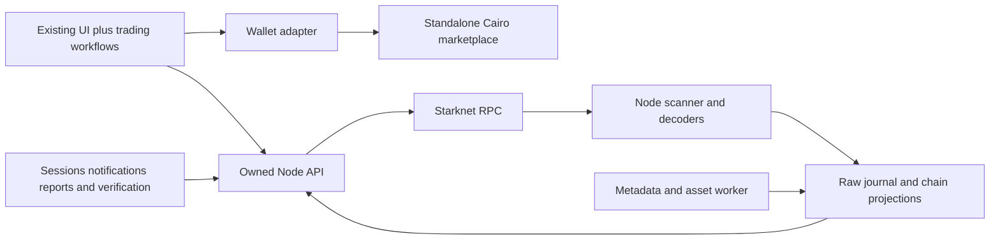
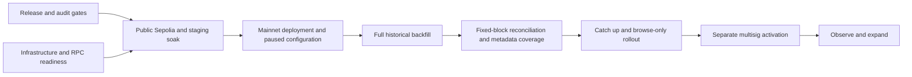

# Starknet marketplace — full scope and build plan

Version 1.3 · 8 October 2026

**Start here.** This is the consolidated project plan. It joins the contract, indexer, API, existing frontend, OpenSea product benchmark, operations and migration into one delivery sequence. It supersedes earlier launch-boundary statements where they differ; supporting documents provide implementation detail and historical evidence.

Status: **public mainnet trading activated on 8 October 2026**, following explicit
user approval to waive the remaining launch gates. Realms historical backfill and
pinned supply/ownership/approval reconciliation passed; the public API reported
zero lag and `safeForCheckout=true` after activation. See the
[activation record](evidence/mainnet-activation-2026-10-08.json). Independent audit,
public Sepolia/supported-wallet acceptance, staging soak and other incomplete
operational checks remain open; activation does not mark them passed. Earlier
paused-rollout measurements below are historical evidence. Track remaining
acceptance work here.

## 1. Product outcome

Build an OpenSea-quality NFT marketplace for the Realms ERC-721 collection at launch: discover assets, understand the market, list and reprice inventory, buy/sweep, make and accept bids, manage orders, and follow trading activity.

Keep the current UI's visual design and reusable components. Extend it for the missing workflows. Build standalone Cairo settlement and an owned Node.js indexing/API backend. The new marketplace must operate without Torii, Dojo World storage, Cartridge-hosted market data or Arcade SDK trading logic.

OpenSea is the NFT product benchmark, not a claim of exhaustive feature parity. The concrete release checklist below defines completion.

## 2. Decisions and remaining choices

| Item | Plan |
| --- | --- |
| UI | Retain Next.js, existing visual system, routes and reusable components |
| Settlement | New standalone Cairo contract; direct storage and explicit events |
| Order creation | On-chain, confirmed by user |
| Core assets/actions | ERC-721 listings, token offers, atomic single-currency cart, confirmed by user |
| Indexing | Our own Node.js implementation; direct configurable Starknet RPC |
| Backend dependencies | Owned Node indexer with Node built-ins; `pg` PostgreSQL driver approved on 8 October 2026 |
| OpenSea launch expansion | Include collection offers, bulk seller workflows, trader dashboard, search/analytics, trust tools and in-product notifications in this consolidated target plan |
| Collection offers | One-shot offers for any NFT in a specified collection; no partial fills. Implemented in the version-1 ABI |
| Data scope | Realms ERC-721 only at launch, confirmed 8 October 2026; other collections deferred to operator-led onboarding |
| Backend storage | Migrating to PostgreSQL, with separate market/chain/application schemas, ordered block commits and protected application data |
| Pricing | Confirmed fixed buyer debit, fees/royalties deducted from that total; no executor surcharge |
| Royalties | Confirmed snapshots for token-specific orders; bounded fill-time royalties for collection offers |
| Administration | Confirmed non-upgradeable contract, limited multisig administration, cancellation available while paused |
| Hosting | Railway staging (Sepolia) and production (mainnet), confirmed 8 October 2026; project provisioned; launch monitoring and capacity acceptance still open |

User confirmed inclusive buyer pricing, token-order royalty snapshots, capped fill-time collection royalties and a non-upgradeable contract with limited administration on 6 October 2026. The implementation caps protocol fees at 500 basis points; production economics and administration must be recorded as explicit deployment inputs. These are material decisions, not numbers to invent during deployment. On 8 October 2026 the user authorized administrator updates to fee rate and recipient. `set_fee` atomically changes the new-order rate (0–500 bps) and future-fill recipient. Orders snapshot their rate; creation binds `max_fee_bps` so signing-time increases cannot change agreed deductions. Existing orders retain their rate, while fees route to the current recipient. Contract code remains non-upgradeable. The user subsequently selected an initial 500-bps fee and the local deployer signer as its recipient; the local deployment draft records that address. STRK and LORDS are selected payment currencies. The signer was subsequently confirmed as initial administrator, with a 60 STRK per-transaction ceiling; deployment records capture the completed paused bootstrap. The broader product target does not change the user's selection of on-chain orders or ERC-721-only launch.

### Collection expansion — authorized 9 October 2026

The user selected Loot Chests, Cosmetics and Golden Token alongside Realms.
The candidate `config/marketplace/registry.expansion.json` pins their contract
classes and historical start blocks. Read-only RPC probes confirm ERC-721 and
ERC-2981 support; sampled royalties are 500 bps. Loot Chests and Cosmetics expose
`token_is_locked`, which preflight must check at the same pinned block as ownership.
The UI uses reviewed royalty ceilings and displays minimum seller proceeds;
no editable royalty field is reintroduced. Existing Realms orders retain zero
royalties. Expansion rollout is in progress: separate backfill, multi-collection
supply/ownership/approval reconciliation, atomic projection cutover preserving
application data/media, then administrator allowlisting and live verification.

### PostgreSQL migration — authorized 8 October 2026

Replace the production SQLite store with PostgreSQL using `pg`. Preserve the public
SDK/API and deployed Cairo contracts. Use dedicated market tables and indexed
columns, JSONB metadata, separate application permissions, a single ordered
projection writer and bounded connection pools. Split Railway API, index and
metadata processes into services with per-environment PostgreSQL. Preserve current
SQLite/app/media snapshots for rollback; compare imported row counts, full-content
digests and checkpoint identity before switching. Trading stays paused. This is
implemented and under deployment validation. Twenty PostgreSQL integration tests
cover migration, scanner/replay parity, concurrent reads/auth, roles, crashes, leases
and recovery. A PostgreSQL 18 dump/restore of the saved 3,163-block/1,623-token
Realms sample passed full-content parity; this is not a production-size restore
claim. Both Railway environments have migrated to PostgreSQL. Production imported
56,824 blocks, 3,938 tokens, 4,108 events and 89 assets at checkpoint 720985; its
Railway PostgreSQL dump/restore passed every source-table digest. The separate
scanner resumed past checkpoint 721085 and metadata processing resumed.
[Migration evidence](evidence/postgres-cutover-2026-10-08.json) records counts,
digests and identity. The contract remains paused; full historical backfill is open.
Backfill RPC acquisition remains a separate performance concern. The follow-up
throughput change adds bounded JSON-RPC batches, rate-limit backoff, compact receipt
processing and atomic bulk header/progress writes. An isolated Railway database
benchmark improved from 13 to about 7,600 empty blocks/second with exact row parity;
this is **not** the end-to-end backfill rate. Production throughput must be measured
against the RPC quota. See the PostgreSQL operations throughput controls.

### Fast historical mode — approved 8 October 2026

The user explicitly approved changing historical verification to accelerate the
Realms backfill. Older NFT-only history may use bounded event ranges: every returned
event-bearing block is checked against full receipts, and finalized range anchors
are checked before and after acquisition. Empty historical blocks are not fetched
individually. This is not a claim of independent completeness for every historical
event; live inventory is reconciled at a pinned checkpoint before trading.

The reviewed Realms ERC721Votes profile supplies a timestamp checkpoint total.
All indexed live owners and token approvals, observed operator pairs and each live
owner's marketplace approval are checked at that fixed block. Supply equality plus
owner checks verifies complete live inventory. A mismatch keeps checkout blocked.
The checkpoint is before marketplace deployment; marketplace/recent activity retains
strict full-receipt scanning. Schema v2 records sparse historical ranges and rewinds
an intersected range completely. Prior pre-v2 indexer binaries must not be used once
sparse history exists; disable fast mode in a compatible v2 release for rollback.

Production is running this mode. The first 300,000 blocks averaged 3,110 blocks/s;
[recorded evidence](evidence/fast-history-2026-10-08.json) includes the pending
reconciliation gate. This is an early-range measurement, not completed backfill
or launch acceptance. Trading remains paused.

### Railway hosting — confirmed 8 October 2026

Host frontend, API, indexer, metadata and PostgreSQL on Railway with isolated
`staging` and `production` environments. `.railway/railway.ts` defines separate
services and environment-local PostgreSQL volumes; the old SQLite volumes remain
for migration rollback. The retained backend volume currently requires one API
replica and no overlapping deployments. See [Railway setup](RAILWAY.md) and
[PostgreSQL operations](POSTGRES-OPERATIONS.md). Production uses the paused mainnet
contract and continues Realms backfill; staging stays on Sepolia and still needs
its funded signer/test deployment. Infrastructure setup does not close launch gates.

### Realms-only launch baseline — confirmed 8 October 2026

The launch NFT collection is **Realms**. Use its actual contract behavior, historical
transfer/approval events, token URI encoding and traits as the baseline for scanner
fixtures, asset compatibility, full backfill and fixed-block reconciliation.

The existing registry identifies Realms on `SN_MAIN` as
`0x07ae27a31bb6526e3de9cf02f081f6ce0615ac12a6d7b85ee58b8ad7947a2809`,
with start block **664162**. A read-only mainnet check on 8 October 2026 found
this address at block 664162 and received `Contract not found` at 664161. The
name at deployment is `Realms (for Adventurers)` and symbol `LootRealm`. The
class hash is `0x42731c2355af9d59eda314ea3cca49ea3cc85173b2ca3c35c6c9df1c087cc43`.
This is single-provider identity/boundary evidence, not full historical acceptance.
Recheck identity at the selected reconciliation checkpoint. `config/marketplace/registry.realms.json` is the
single-collection indexing baseline; its marketplace identity is unset and its
currency list is empty pending reviewed deployment inputs. Use a separate scratch
DB for NFT-only investigation and a fresh deployment-bound DB for launch.

Season Pass, Loot Chests, Cosmetics, Golden Token, Beasts and Adventurers are
outside the initial release. Their specialized metadata and game eligibility are
not launch requirements. Check Realms' own transfer restrictions and royalty
behavior explicitly. The settlement contract and SDK retain generic ERC-721
support; initial production collection approval must contain only Realms.

Acceptance work proceeds in this order: scanner failure/crash-recovery tests (expanded locally on 8 October);
Realms event/metadata compatibility fixtures; full Realms history to a fixed
checkpoint; external ownership/approval/order/accounting reconciliation;
metadata/media coverage; representative load/restore and staging soak. Realms NFT
history can be investigated before the marketplace deploys; marketplace order
history begins at the new settlement deployment. A Realms-only launch still
requires the trading, security and operational gates below.

## 3. Launch scope

| Workstream | Launch deliverables | Completion evidence |
| --- | --- | --- |
| Trading contracts | Listing, token offer, one-shot collection offer, cancellation, bounded bulk cancellation, fill, accept offer, atomic cart | Contract invariants, malicious-callback tests, fork tests and independent review |
| Seller tools | Inventory selection, bulk list, cancel, cancel-and-relist/reprice, fee/proceeds preview | Complete wallet-to-indexed-result flows |
| Buyer tools | Listing purchase, filter-aware sweep, cart, token/collection bid, funding/approval checks | Correct totals, usable bid selection and atomic transaction tests |
| Order management | My listings; offers made/received; active, expired, cancelled, filled and currently unavailable states | Ownership-aware account feeds, pagination and action tests |
| Discovery | Collection/NFT/address search; full-collection filtering/sorting; token details; existing game-specific traits | Search/filter fixtures, later-page matches and large-ID tests |
| Market information | Current floor/top executable bid by currency, recent sales, declared-period volume/counts, price/floor history | Defined metrics reconciled to fill events |
| Portfolio | Holdings, collection filters and purchased/sold activity | Balances reconcile and confirmed changes become visible |
| Notifications | In-product offer/sale/order-change inbox and unread state | Authenticated ownership, deduplication and reorg correction tests |
| Collection operations | Register/backfill/reconcile/publish; verified-address/name policy; metadata refresh | Operator onboarding rehearsal |
| Trust/content | Report submission, review queue, content visibility controls and decision history | Authorization tests and a documented operating policy |
| Assets | Owned metadata/image delivery, dynamic trait refresh and explicit failure states | Coverage report and stale/failure behavior |
| Operations | Metrics, alerts, RPC failover, backup/restore, replay and rollout | Recovery/load/soak evidence and named operator |
| Migration | New approvals/orders; clear separation from Arcade; bounded legacy cancellation/history decision | Rehearsed cutover with no unauthorized order recreation |

Preserve single-currency checkout and maximum 25 NFTs. Across approved currencies, do not compare raw amounts as if they share value. Portfolio and search cover indexed registered collections; arbitrary all-Starknet discovery is not implicitly included.

### Follow-up releases

Trait/criteria offers, private/reserved listings, watchlists and richer profiles, email/push notifications, portfolio NFT transfers, permissionless collection onboarding, ERC-1155/partial fills, signed gasless orders, auctions and bundles are outside this launch plan. Prioritize them by demonstrated demand.

Trait offers need a separate decision about fixed token-set membership versus live on-chain predicates, particularly for mutable game attributes. A backend trait match cannot authorize spending. Features that change immutable contract semantics may require another deployment; do not pretend they are merely frontend additions.

## 4. Architecture and ownership

- **Contract:** authoritative order authorization, exact settlement, cancellation, pause and supported-asset policy. No backend trust for execution.
- **Indexer:** canonical events, ownership/approval projections, terminal order state, progress and recovery.
- **API:** filtering, summaries, account queries, consistent pagination/provenance and advisory preflight.
- **Application data:** sessions, notifications, reports and verification decisions. These cannot be regenerated from chain events and need separate backups/migrations.
- **Frontend:** user intent, wallet signing, clear totals/errors and transaction/index progress. It cannot silently mutate order terms.

Use a single backend codebase with separate writer, API and metadata processes. No required external queue or search service at launch. Preserve a clean product interface so later storage changes do not rewrite the UI. Cairo compiler/test tooling and proposed reviewed contract primitives are separate from the backend dependency policy, which now permits `pg` for PostgreSQL.

### Reusable marketplace packages — extraction map, 7 October 2026

Status: implemented locally as private 0.1.0 workspace packages; not published. The existing Next.js app stays in place and consumes public package exports through retained view-model/wallet adapters. TanStack Query was explicitly selected by the user for fetching; Query Core is the SDK runtime dependency and React Query powers the optional React bindings. The backend package remains independently deployed.

**Package structure**:

- `packages/marketplace-sdk` → `@biblio/marketplace`: framework-independent TypeScript, ESM plus declarations, explicit exports and TanStack Query Core as its runtime dependency. Runs in modern browsers and Node without importing Next.js, React, Zustand, wallet connectors or SQLite. Owns typed reads, order preparation, amount/identity invariants, approval planning, transaction lifecycle and recovery. Ships versioned contract ABI assets and protocol compatibility checks. The ABI export remains generated from the Cairo contract rather than maintained by hand.
- `packages/marketplace-react` → `@biblio/marketplace-react`: optional provider, query hooks, action hooks and reactive transaction state over the SDK. React and TanStack Query are peer dependencies. Wallet integration is an explicit adapter; the core SDK does not choose, connect or install a wallet. The main app supplies the reference Starknet React wallet adapter; wallet-specific dependencies stay outside the published SDK.
- `services/marketplace-backend`: remains a separately operated indexer/API. A consumer supplies its own compatible endpoint or uses an explicitly configured shared deployment. Installing the SDK does not run an indexer or remove the need for indexed data. Operator credentials, journal/storage, scanners, metadata workers and server signature verification remain server-side.
- Main app: imports the packages using `workspace:*`. Owns routes, shadcn/Tailwind rendering, brand assets, collection/game presentation, wallet chooser, URL state and cart drawer. Cart selection/validation and transaction rules come from the SDK; drawer visibility and messages remain presentation concerns. Storybook uses the same public package interfaces with fixture adapters.

**Source-to-package map**:

| Existing implementation | Destination / treatment |
| --- | --- |
| `src/lib/marketplace/api-client.ts`, domain types and API read logic | SDK typed client; inject endpoint, network, fetch and request policy. Replace app environment reads and fixed localhost paths. Keep legacy view-model conversions private to app migration. |
| `write-adapter.ts`, amount/royalty/order identity helpers, ABI | SDK protocol internals and deliberately exported advanced call builders; exact bigint arithmetic and explicit currency metadata |
| Checkout in `cart-sidebar.tsx`, creation/repricing in `order-composer.tsx`, acceptance in `accept-offer.tsx`, cancellation in `trader-dashboard.tsx` | SDK semantic trade preparation methods; remove duplicated business logic from views |
| `use-trade.ts`, `pending-transaction.ts` | Framework-independent transaction coordinator with account, receipt, storage and clock adapters; React subscribes to it |
| `react.tsx`, `hooks.ts`, query helpers | React package using SDK reads and instance-scoped query keys |
| `use-wallet-session.ts` | SDK challenge/verification requests and injected signing; React binding. Server verification stays in backend. |
| Cart store and listing utilities | Pure cart constraints/candidate selection in SDK; optional instance-scoped React state adapter; persistence supplied explicitly |
| `seo-data.ts` | App-specific metadata construction using the SDK server client |
| Realms images, game filters, wallet chooser, components and route shells | Remain app-owned; reusable branded UI is a separate future deliverable |

**Public interface**:

1. `createMarketplaceClient({ apiUrl, chain, chainId, expectedMarketplace, fetch?, queryClient?, headers?, credentials?, timeoutMs?, assetBaseUrl? })` creates an isolated client. Read-only use needs no wallet. Trading requires a pinned expected deployment and compatible API/contract versions. Currency metadata, cache identity and pending records are scoped to the client/deployment; no shared mutable currency maps, global transaction store or implicit browser storage.
2. Typed read groups cover collections/tokens/traits, listings/orders/offers, search, account holdings/orders/activity, statistics/best bid, configuration/status and transaction reflection. Expose cursor pagination, query cancellation and structured errors. Do not silently fetch all pages, round chain values or convert failures into empty results.
3. `trades.prepareListing`, `prepareTokenOffer`, `prepareCollectionOffer`, `prepareBuy`, `prepareAcceptOffer`, `prepareCancel` and `prepareReprice` accept domain intent and account identity. Bulk input reuses these methods and preserves current limits. Preparation returns reviewable terms, approval requirements, calls, per-item failures, freshness and account/deployment binding. Distinguish exact settlement quotes from estimates/caps. Preflight remains advisory.
4. `trades.submit(prepared, accountAdapter)` validates binding, expiry, current account/network and reviewed payment/proceeds bounds before requesting a signature. A refresh that changes reviewed terms requires a new review; never silently expand an approval or payment. Signing is an explicit action, never an effect of mounting a hook or fetching data. Low-level calldata builders remain an advanced escape hatch with clearly documented caller responsibilities.
5. Submission returns a transaction handle/hash separately from receipt acceptance and index reflection. `transactions.watch` / `resume` expose typed progress and recover retained records without resubmission. Scope concurrency by account and deployment; coordinate consumers of the same client. Document that separate tabs/processes require a shared coordination adapter if cross-context locking is desired. Unknown submission outcomes must not be retried automatically.
6. Authentication supports public reads without a session and explicit wallet verification for inbox/report actions. Same-origin proxy is the default app integration. Cross-origin integration requires a deliberate backend origin/cookie policy or a compatible BFF; do not assume the current session cookies work on arbitrary domains. Server clients use per-request credentials, never a global user session. Keep operator operations out of the browser package.

**Migration sequence**:

1. Inventory every marketplace read/write call site and freeze existing behaviour with public-interface tests. Record ABI/API versions and exported types; do not expose legacy Dojo/project configuration as new SDK concepts.
2. Create workspace packages, build/type/export configuration and packed-artifact checks. Start private; publication is a separate release decision.
3. Extract protocol types, exact amounts, identity, ABI and the injected HTTP client. Migrate app reads and SSR reads first; app wrappers may temporarily preserve view models but must delegate to the SDK.
4. Extract semantic order preparation and the transaction coordinator. Migrate listing, offers, acceptance, buy/cart, cancellation, bulk repricing and recovery one workflow at a time. Delete the superseded app business logic after each migration.
5. Add the React provider/hooks and wallet adapter. Migrate all app call sites and Storybook fixtures. Any changed UI follows the mandatory Storybook-first responsive workflow.
6. Add a minimal non-React consumer and a minimal React consumer that install packed packages without `@/` aliases or repository source imports. Prove reads and a devnet trading journey from both.
7. Run app regression/Storybook tests, native API compatibility tests and devnet contract/indexer reconciliation through the public SDK. Produce migration and integration documentation. Only then call the main app an SDK consumer and consider publication.

**Extraction acceptance gates**: package imports have no app/env/DOM side effects; two clients with different deployments/currencies are isolated; account/network changes invalidate prepared intent; stale/rejected/reverted/unknown transactions cannot trigger automatic duplicate submissions; 25-item atomic single-currency checkout and cancellation during pause remain intact; packed artifacts contain declarations and ABI assets; browser and Node imports work independently; all app reads and business-level writes use public package exports; no private deep imports or parallel implementations remain. Retain existing coverage thresholds and test through the interface third-party apps actually consume. Package extraction does not satisfy the outstanding real-wallet, historical-indexing or production launch gates below.

## 5. Contract design to freeze at M0

Use `(maker, maker_nonce)` within a deployment, with full external identity including chain and marketplace address. Terms never mutate; repricing cancels and creates a new order. Each ERC-721 order fills once, quantity one.

Order kinds: `listing`, `token_offer`, `collection_offer`. Token ID is required for the first two and absent for the last; never overload a valid token ID as a wildcard. Collection-offer fill accepts one eligible NFT from the exact committed collection and consumes the order completely.

The buyer commits total debit `P`. Protocol fee `F` and royalty `R` are deducted: seller proceeds are `P - F - R`. No caller chooses an additional fee against another account. Rounding, recipient aliases, uint256 overflow and positive seller proceeds are explicit invariants.

For collection offers, commit collection, currency, total debit, expiry and maximum royalty amount. Resolve selected-token royalty at fill within that cap; the accepting seller passes minimum proceeds. This extension supersedes the token-known-at-creation assumption for that order kind only. Validate policy against supported NFT contracts before implementation.

Implemented entrypoints: create listing/token offer/collection offer; cancel one/many; buy one/many; accept token/collection offer; get order/config; bounded administration. Use existing account multicall for bulk creation and repricing first; add dedicated batch creation only if measurements justify it.

Events: initialization/configuration, complete order creation, cancellation, fill with exact economic allocations, trading switches, asset-policy changes and administrator transfer. They must reconstruct new-market state without an external orderbook or generic model engine.

Cross-reference [contract scope](./CONTRACT-SCOPE.md) for settlement guarantees and the token-specific/collection-offer confirmed royalty policies.

## 6. Backend deliverables

### Indexing

Bounded RPC event scanning, full continuation handling, receipt-derived event identity/order, pinned block/hash windows, raw journal, deterministic decoders, atomic block projections/checkpoints, per-stream progress, reorg undo/replay and schema-versioned rebuilds. Never report the fastest stream as proof every required collection is caught up.

NFT backfill starts at verified historical collection blocks. New trading history starts at our deployment. No legacy World decoder is a prerequisite for launching the new market.

### Public product API

Retain the base `/v1/chains/{chain}` interface. Provide collections, tokens, traits, orders/listings, collection offers, token/account activity, holdings, market configuration, batch order lookup, index status and checkout preflight. Add:

- Global collection/NFT/address search.
- Account order feeds filtered by made/received/listed and state.
- Collection statistics and time series by currency and declared interval.
- Best executable bid queries for a token, comparing seller proceeds when token and collection offers compete.
- Authenticated notification inbox/read state and report submission.
- Private operator interfaces for registry/onboarding, refresh, verification and content decisions.

Every candidate bid includes validation freshness. Incoming offers follow current NFT ownership. Unknown funding/approval is not a guaranteed executable offer. APIs return decimal strings for large values and stable, bounded, query-scoped cursors.

### Metadata and owned application data

Persist metadata jobs, URI/content versions and fetch status; bound unsafe destinations, redirects, sizes and retries. Failed images do not stop trade indexing. Dynamic game eligibility has its own freshness/authoritative-check policy.

Wallet-authenticated sessions use expiring, single-use, domain-bound challenges with independently verified signature/message encoding. Do not trust a client-supplied message hash or treat a public address lookup as authentication. Test supported wallet signature behavior before choosing the exact native implementation. Operator access uses separately managed credentials/roles.

Keep durable application data separate from replayable chain projections, whether in separate SQLite files or explicitly managed schemas. Notification generation is idempotent by canonical event and recipient. A reorg can invalidate an alert; unread state and user reports must not be erased by replay.

## 7. Frontend work while retaining the UI

| Surface | Changes |
| --- | --- |
| Home/discovery | Real indexed search, useful collection metrics and honest featured/trending labels |
| Collection | Full-dataset filters/sort, current listings and bids, collection-offer action, charts and sweep selection |
| Token | Exact total/proceeds, token and matching collection offers, history and safe acceptance |
| Portfolio/trader dashboard | Inventory, bulk actions, my listings, offers made/received and trade activity |
| Cart | One-currency selection, exact total, per-row failures, new `buy_many` calldata and limit checks |
| Notifications | Wallet-owned inbox, read state, links to actionable orders/tokens |
| Collection trust/reporting | Verified-address display, reporting entrypoint, restricted-content behavior |
| Ops | Real index/API progress, collection readiness and action-oriented operator diagnostics |
| SEO | Owned server-side reads and images with unavailable/stale fallbacks |

Persist submitted transaction identity. Distinguish wallet rejection, submission, acceptance/reversion and index reflection. Never invite duplicate submission because indexing is slow. Migrate persisted cart identities explicitly; invalidate incompatible old rows with an explanation.

### Discovery and market-information pass — 8 October 2026

Implemented locally, covered by unit and Storybook browser tests, and checked
against the fixture backend; not evidence of production validation:

- Chrome: the Realms.World ecosystem bar (Home, Games, Account, Marketplace,
  Scroll, community links) sits above the sticky marketplace toolbar, as in the
  earlier alignment work, with the same links in the mobile menu and footer.
- Home: collections ranked in the configured order with floor, 7-day volume,
  listed share and supply (sortable), the featured collection's recent sales,
  and a spotlight panel; one catalog request plus one statistics request per
  collection.
- Collection: market header (floor, top offer, 7-day volume and sales, listed
  share, supply) beside a segmented market-currency control; Items, Offers,
  Activity and Analytics tabs kept in the URL; in-collection search, listed-only
  filter, sort select, layout toggles and removable filter chips; analytics
  charts for floor history, volume, sales and listing depth with table twins.
- Token: collection breadcrumb, owner link, price/top offer/last sale tiles,
  order forms opened on demand, trait rarity and in-game resource artwork.
- Artwork: cached assets fall back to the origin URL and alternate IPFS
  gateways in the browser; the metadata worker keeps the origin URL on cache
  failure, decodes inline data URIs, sniffs generic content types, paces JSON
  fetches and backs off permanent failures.

Still open from the table above: honest featured/trending labels beyond
"recent sales", bulk portfolio actions, and notification links.

### Link previews pass — 10 October 2026

Implemented locally, covered by unit, renderer and Storybook browser tests, and
checked against the fixture backend; not evidence of production validation:

- Asset links unfurl as a generated card: artwork, collection, name, up to
  seven traits and the price the asset page shows (cheapest fillable STRK
  listing, otherwise the cheapest listing in the next configured currency;
  unlisted assets show the top offer, then the last sale). Realms show only
  resources; Loot Chests epoch and ID; Cosmetics epoch, rarity and type;
  Golden Tokens the item number. The previous token image route failed to
  render, and relative cached artwork URLs were dropped from metadata.
- Collection links show banner art, floor, listed count and supply; every
  other page uses a site-wide card. Image URLs carry a content version so a
  price change yields a new URL for unfurlers that cache by URL; already
  posted messages keep their original preview.
- The server only reads backend-cached artwork, files in `public/` and inline
  data URIs; it never fetches metadata origins. WebP/AVIF and uncached art
  fall back to collection artwork rather than adding a transcoder.
- The asset page has a Share menu, and an owner sees a share prompt once
  their listing is indexed. Dismissing it hides it for that listing on that
  device. Token preview data is cached for up to 60 seconds, so the prompt
  says the price usually appears within a minute rather than immediately.
  The share text prices from the holder's own listings, as the card does.
- Cosmetics has a local collection image, a banner collage and a share
  banner, so its cards, header and link previews no longer depend on IPFS
  artwork.
- Share rendering retries a failed font load, API client import or public
  file read on the next request instead of failing until restart.

Remaining evidence: share real launch-collection assets from staging to
Discord, X and Telegram; measure how much artwork is WebP/AVIF or uncached;
confirm SVG artwork containing text renders in the production container,
which may lack system fonts; and exercise the owner prompt with a real
wallet. The prompt follows the page's STRK listing query, so an owner whose
only listing is in another currency does not see it.

## 8. Build sequence and gates

Roles below are responsibilities, not a claim that people have been assigned.

| Milestone | Concrete work | Depends on | Exit gate | Lead responsibility |
| --- | --- | --- | --- | --- |
| **M0 — freeze product/protocol contract** | Confirm fee/royalty/admin choices; collection-offer semantics; launch asset registry; ABI/events; expected accounting fixtures | Current plan | Reviewed interface, test matrix, dependencies and open decisions recorded | Product + Cairo |
| **M1 — reference settlement** | Test-first create/cancel/fill for listing, token offer and collection offer; explicit events; direct reads | M0 | Authorization, exact debit, expiry, pause cancellation, duplicate fill and callback tests pass | Cairo |
| **M2 — vertical slice** | One ERC-721, native RPC scanner/journal/projection, basic API and UI wallet adapter on devnet | M1 event fixtures | List → buy; offer → accept; cancel → reflected state; restart and replay agree with contract | Backend + frontend |
| **M3 — full indexing/data API** | All launch collection backfills; metadata; query/filter/holdings/account feeds; search; reorg recovery | M2 | Collection matrix and fixed-checkpoint reconciliation; no hosted reads | Backend |
| **M4 — cart and contract optimization** | `buy_many`; account bulk create/reprice/cancel; malicious asset cases; resource benchmarks | M1 | Atomic worst-case 25-item cart fits practical limits; no invariant regressions | Cairo |
| **M5 — complete trading product** | Seller/buyer dashboard, token and collection bids, sweep/cart, exact fee displays, new IDs and SEO | M2; final gate needs M3/M4 | Buyer/seller journeys pass with supported wallets, including failures | Frontend |
| **M6 — market/trust features** | Statistics/history, top executable bid, operator onboarding, authenticated inbox and reports | M3 + session design | Metrics reconcile; auth/content/notification acceptance tests pass | Backend + frontend + operator |
| **M7 — review and production readiness** | Independent contract review/fixes; fork tests; RPC/load/restore/failover; deployment configuration and class verification | M1/M4 interface frozen; final gate needs M3–M6 | Resolved review findings; green CI; rehearsed recovery; named operator | Cairo reviewer + platform |
| **M8 — migration and controlled launch** | Legacy inventory/cancel plan; Sepolia rehearsal; final classes/registry; new spender approvals; staged release and soak | M7 | All launch journeys work against real deployment; health within agreed thresholds | Release owner |

Critical path: M0 → M1 → M2 → validated event/API integration → completed product and contract review → M8. M3 and M4 can be scheduled concurrently after M2/M1 respectively; frontend can use fixed fixtures before backend completion. Independent review can start after the contract interface and implementation stabilize, but any material later changes need review coverage.

### Current implementation status — 7 October 2026

| Area | Implemented locally | Remaining launch evidence |
| --- | --- | --- |
| Cairo | Standalone non-upgradeable v1, 17 entrypoints, listing/token/collection offers, atomic cart and limited administration | Independent audit; actual launch-asset compatibility and fork/resource checks |
| Indexer/API | Owned Node scanner, async PostgreSQL store/catalog, verified SQLite import, replay, metadata, preflight, sessions, reports and notifications | Historical backfill, fixed-checkpoint external reconciliation, dynamic game policies, production load/restore/failover |
| SDK | Private workspace packages, TanStack fetching, full v1 ABI coverage, direct reads, governance and recovery | Deployment integration; packages are not published |
| UI | Owned reads/trading, wallet entry points, full-width discovery, consistent spacing, reusable Storybook components | Real supported-wallet trading/recovery; on-chain admin console is not implemented |
| Local verification | Unit, Storybook/a11y, SDK packed consumers, backend, Cairo and devnet replay suites exist; CI runs required checks | Green remote CI, Sepolia rehearsal, migration decision and seven-day soak |
| Deployment | Backend container/Compose and runbook; release-tree guard and local verification command | Final addresses/class/start block, fees/admin, reviewed registry, host/domain/RPC, operator and monitoring ownership |

Run `pnpm release:verify` for reproducible local checks. The latest preparation
results are recorded below; earlier counts and individual implementation reports
are [historical evidence](history/IMPLEMENTATION-EVIDENCE-2026-10-07.md), not current
release approval. Demo screenshots and local fixtures do not close launch gates.

### Release preparation — 7 October 2026

- Local settings remain on disk but `.env.local` is removed from source control;
  nested workspace dependencies, secrets, data and build artifacts are excluded
  from Git/Docker release contexts. CI includes the release-tree guard.
- `pnpm release:verify` pins local fixture settings and runs reproducible SDK,
  backend, Cairo, coverage, build and browser gates; actual deployments require
  a separate build with reviewed environment inputs. `pnpm release:audit` is a
  separate registry/network gate, now enforced in CI and passing with zero high
  or critical findings after transitive wallet dependency remediation.
- Next.js/ESLint config updated to 16.3.6: production audit critical findings
  reduced from 2 to 0. Remaining wallet/transitive findings are detailed in
  [operations](OPERATIONS.md#dependency-audit--7-october-2026).
- Superseded local output is archived under `.context/archive`; dated progress
  reports are in `docs/history`. The unused Arcade-era starter shell was removed.
- Final local verification on Next.js 16.3.6: 565 unit/Storybook tests, 40 SDK
  interface tests, 34 backend tests, 14 Cairo tests (including 256 fuzz cases),
  non-fixture Cairo build, packed consumers, typecheck/lint, Storybook/Next builds
  and four browser smoke tests pass. The optional screenshot test was skipped.
  Coverage remains above unchanged 70% gates (81.97% statements, 70.67% branches,
  81.39% functions, 82.88% lines). Added release-guard tests also pass. Frozen
  lockfile validation and local documentation link checks pass.
- Compose template validates; container image build/boot remains unverified
  because the local Docker daemon did not respond. Production deployment inputs,
  remote CI, independent review, supported-wallet/fork checks, backfill, recovery,
  Sepolia rehearsal and soak remain open. No deployment or new commit was made.

### Adversarial contract review — 7 October 2026

[Review report](CONTRACT-ADVERSARIAL-REVIEW-2026-10-07.md): no high-confidence
settlement vulnerability confirmed in this pass. Added 16 tests and test-only
receiver/payment callback probes. All 30 Cairo tests pass, including 512 fuzz
cases and reentry attempts against all 14 mutating entrypoints. The 40 SDK tests
pass. Production source, ABI and both class hashes are unchanged. Actual asset
compatibility, game eligibility, supported-wallet/fork testing and independent
audit remain launch gates; this local review does not close them.

### Mainnet deployment tooling — 7 October 2026

Implemented the [staged deployment workflow](MAINNET-DEPLOYMENT.md): read-only
identity probing, artifact/source/ABI verification, deterministic UDC plans,
bounded V3 declaration/deployment, final administrator in the constructor,
atomic paused configuration, multisig call export, canonical receipt and exact
Cairo 1 calldata verification, durable submission journals, explicit recovery,
current-policy replay, and indexer/frontend environment/registry exports.
Activation evidence is collected later and bound to the original plan digest.
Mainnet sends require reviewed evidence references, the exact plan digest, a
clean matching commit, correct signer/network/classes and bounded resource fees.
References record operator approval; scripts do not independently certify audits.

Validation: 22 deployment-specific tests and all 517 unit tests pass, as do lint,
typecheck, frozen-lockfile and release-tree checks. A signed localhost devnet
0.10.0 rehearsal used separate deployer/admin accounts, declared/deployed the real
marketplace, configured it paused, exported verified handoff files, recorded an
externally signed activation with later evidence, verified canonical receipts and
policy state, and confirmed that repeating a completed deployment did not consume
another nonce. The RPC needs historical state; the rehearsal uses full archiving.

No public Sepolia or mainnet transactions were sent. Production inputs remain
blank in the examples. Mainnet audit/dependency/asset/wallet/operational gates are
unchanged. The tooling supports standard Cairo 1 account multicalls; nonstandard
multisig execution wrappers need separate integration rather than relaxed receipt
verification. Local rehearsal evidence lives under `.context/deployment-rehearsals`.

## 9. Test and optimization matrix

| Layer | Required checks |
| --- | --- |
| Contract | Maker authorization; terminal state; cancellation under pause; exact expiry; allowance/funds/ownership; exact payment; royalties; recipient aliases; reentrancy; false/reverting token calls |
| Collection offers | Correct collection, arbitrary valid token ID, one-shot consumption, royalty cap, seller minimum, token-specific royalty variation and concurrent attempts |
| Batch | 1/5/10/25 items, duplicate order/NFT rejection, one-currency bound, late failing item, overflow, full rollback |
| Indexer | Missing pages, provider failover, duplicate events, empty ranges, crash mid-block, differing stream heads, hash conflict, reorg, fresh replay |
| Product queries | Full-dataset filters/sorting, game-specific semantics, large IDs, precision, dynamic traits, pagination changes, funded versus nominal top bid |
| Application data | Wallet challenge replay/domain binding, access control, report abuse limits, notification deduplication/reorgs, backup preservation |
| UI | Complete workflows and failure states; no false success, duplicate transaction or cross-chain/cart identity confusion |
| Operations | Representative load, disk growth, RPC throttling/outage, asset failures, database restore and deployment rollback |

Measure Cairo storage writes, execution resources, calldata/events and external calls, including account/approval costs. Compare native cart settlement against repeated fills in account multicall. Keep uint256 token/payment precision. No gas savings are claimed before measurements.

Proposed initial operating targets: browse p95 under 500 ms; 25-row preflight p95 under 3 seconds; normal p95 relevant-stream lag no more than two accepted blocks; backups at most one hour old and recovery within two hours. Freshness also checks observation age. Validate targets at representative load and revise explicitly if the chosen topology cannot meet them.

## 10. Launch sequence, indexer rollout and migration

This is the operational launch plan. It is **ready for assigning owners and filling
inputs, not approved for execution**. Roles below are unassigned. The contract
commands are in [mainnet deployment](MAINNET-DEPLOYMENT.md); service/backup commands
are in [operations](OPERATIONS.md). Stages advance on evidence, not calendar dates.

### Current go/no-go position

At the previously reviewed PR #93 commit `e2b8cf1`, remote contract and application CI and the Vercel preview
passed. Foundry and `snforge_std` use 0.64.1, Universal Sierra Compiler uses 2.10.2,
and Scarb remains 2.15.1 with unchanged production contract hashes. This closes the
previous CI toolchain mismatch; rerun checks on the final release commit.

The updated production audit has zero critical/high findings and five moderate
findings, with the remediation documented in operations. Independent contract
audit, approved asset/fork/resource checks, real supported
wallets, hosting/operator choices and live indexer acceptance remain open. Recheck
CI, audit and artifact hashes on the exact release commit before approval.

### Realms and Railway verification — 8 October 2026

- Railway repository configuration exists for staging and production. Both Docker
  images build locally. Container checks passed for health, private-network API
  proxying, frontend rendering, three supervised backend processes, worker-death
  shutdown and persistence across restart. No Railway resources were created.
- The backend now has 54 passing tests. Added scanner cases cover omitted/duplicate
  events, repeated cursors, pagination outage, changed anchors, wrong/unaccepted
  blocks, bad receipt identity, automatic reorg and on-disk resume. A real SIGKILL
  inside a SQLite transaction confirms rollback to the preceding checkpoint.
- Regression tests exposed missing-event coverage on unsampled empty blocks and
  unchecked receipt height/status. The scanner now fetches full receipts for every
  scanned block and validates them. This increases payload cost; measure realistic
  archive-RPC throughput and disk growth before planning the full backfill.
- Three real historical Realms mint events are checked in as decoder fixtures.
  A live native scan of blocks 664162–664163 passed. That two-block probe contained
  no NFTs and is not a full collection backfill, ownership reconciliation or load
  benchmark. Full history, external reconciliation, metadata/media coverage,
  supported-wallet staging and production-size restore remain open.

### PR #93 review follow-up — 8 October 2026

The three requested changes have regression coverage:

- Per-visitor quotas accept `X-Real-IP` only from configured immediate proxy peers.
  Railway configuration trusts the environment-local frontend DNS identity and
  requires its public ingress to overwrite client-IP headers. Direct callers and
  arbitrary forwarded chains do not gain trust; liveness probes bypass quotas.
- Every source checkpoint records its historical start. Earlier boundary changes,
  including marketplace history, immediately block readiness and scanning until a
  fresh backfill. Old databases without that evidence also fail closed.
- The marketplace toolbar exposes unknown-submission recovery. Users confirm a
  wallet hash, which is checked against the active network and sender, or explicitly
  confirm non-submission after checking the wallet. Lookup failures and wallet/
  network changes retain the lock. Neither action signs or resubmits a trade.

Local release checks passed: 599 unit/Storybook tests, 40 SDK tests plus packed
consumers, 30 Cairo tests, production/Storybook builds and four browser smoke flows.
The final backend suite has 60 tests. Recovery stories were checked at 320, 768
and 1440px, with keyboard operation, error retention and wrapped controls. Recheck
remote CI on the pushed commit; these checks do not replace live-wallet or Railway
staging acceptance. See operations for required old-database replacement.

### Administrator fee updates — 8 October 2026

`set_fee` updates the default rate and recipient atomically, with the existing
500-bps ceiling, nonzero recipient and reentrancy/administrator checks. Creation
binds a maximum fee and snapshots the accepted rate. Existing listings and offers
retain that rate; fills use the current recipient. SDK builders, direct reads,
order-form calldata, preflight accounting, policy replay and transaction reflection
all use the revised ABI. The class and ABI manifests were regenerated.

Local validation: 526 unit tests, 34 Cairo tests (including 512 fuzz cases), 62 backend tests,
41 SDK/React tests plus packed consumers, 23 deployment-tool tests, nine order-form
Storybook interactions, production/Storybook builds and four application browser
smoke flows. Order-form layouts and keyboard focus were checked at 320, 768 and
1440px. A signed devnet journey exercised fee changes, old-order quotes/settlement,
SDK administration and a complete identical index replay. The signed local deployment CLI rehearsal also passed declaration/deployment, paused configuration, activation and handoff verification. This is local evidence;
it does not close independent-review or public Sepolia/wallet launch gates.

### Paused mainnet bootstrap — 8 October 2026

The user authorized deployment following disclosure of the outstanding independent
review and public Sepolia/wallet checks, and selected the signer as administrator,
a 60 STRK per-transaction cap, a 500-bps fee, signer recipient, Realms and STRK/LORDS.
The [deployment record](../config/marketplace/deployment.mainnet.json) contains the
class/source hashes, original release commit and confirmed transactions. The
[production registry](../config/marketplace/registry.mainnet.json) pins all addresses.
Declaration, deployment and paused configuration succeeded; actual combined fees
were 20.548421090207649568 STRK. A local mainnet fork at block 16049220 verified
sample Realms 1038 listings, approval, NFT delivery and exact 95% seller proceeds
with both real STRK and LORDS classes. This is sample compatibility evidence,
not an exhaustive audit or public-wallet test.

Railway production API/index/metadata services use the verified registry and have
begun the full historical backfill. Production web is rebuilt for the deployment.
Staging services remain separate on Sepolia with a verified PublicNode RPC. The selected signer is not deployed on Sepolia; a funded testnet deployer and test deployment remain outstanding.
This bootstrap does not mark L0–L6 complete or authorize trading activation.

### Release stages

| Stage | Work and responsible role | Exit evidence / go-no-go |
| --- | --- | --- |
| L0 — release candidate | Release owner + contract/frontend leads: fix CI/toolchain and dependency blockers; finish independent audit/remediation; freeze fee/admin inputs, approved assets and legacy-order policy | Green checks on one committed SHA, resolved high/critical findings, audit report, compatibility matrix and signed scope. Exclude assets requiring unsupported on-chain health/trait eligibility. |
| L1 — operational foundation | Platform/indexer lead: provision isolated staging and production environments, persistent local storage, RPC/archive access, secrets, logs, alerts, off-host backup and restore target | Container/native boot rehearsal, correct network/class checks, RPC history coverage, protected operator access, tested alert delivery and named incident owner. Can run alongside L0 without public trading. |
| L2 — public Sepolia + staging soak | Contract/frontend/indexer leads: use the deployment scripts with final account types; rehearse the complete user-to-indexed-result journey and operational failures | Real wallet/multisig signatures, 25-item transaction/resource checks, receipt/index recovery, replay/reorg, RPC outage and backup restore evidence; seven-day staging soak meets agreed operating targets. Local devnet evidence does not satisfy this stage. |
| L3 — mainnet deployment, trading held | Release owner + multisig: freeze the mainnet plan, declare/deploy, verify receipts and atomically pause/configure the approved asset set | Verified mainnet address/class/constructor, canonical deployment block, paused configuration and generated registry/environment handoff. No public trading yet. |
| L4 — production indexer acceptance | Indexer lead: create a fresh deployment-bound database, backfill the full registry, reconcile at a fixed block, hydrate metadata, then catch up and tail | Complete per-source history, zero unexplained ownership/order/accounting discrepancies, explicit metadata/media coverage, current live source progress, measured load and a production-size restore rehearsal. Detailed sequence below. |
| L5 — browse-only cutover | Frontend/platform leads: build for the real deployment, route discovery/holdings to the owned API, preserve the contract pause, validate caches and migration messaging | Public browse/search/portfolio/asset paths work against owned data; wallet actions respect paused state. Proposed observation window: at least 24 hours after catch-up, subject to release-owner approval. |
| L6 — controlled activation | Release owner + multisig: approve activation evidence, unpause, confirm index reflection, execute small real buyer/seller journeys | No unexplained payment/ownership mismatch; listing, offer, cancellation and atomic-cart results reconcile on-chain and in the API. Initial low-volume observation: proposed 24 hours before broad promotion. |
| L7 — general availability and expansion | Release/product/operator owners: publish migration/support guidance, widen promotion, monitor a seven-day mainnet stabilization window after activation (not an additional pre-launch wait); onboard additional assets through the expansion procedure | Stable agreed service levels, no unresolved critical incident, tested incident handoff and retained cancellation/recovery paths. Expansion requires its own registry/backfill/asset approval. |

“Controlled” does not mean private: v1 has no wallet allowlist or per-user trading
limit. Once an approved asset is enabled and the market is unpaused, anyone can
call the contract directly. Real rollout controls are pause and the on-chain
collection/currency allowlists. A private frontend, hidden collection, verified
badge or soft launch announcement is not an on-chain access control.

### Indexer rollout: exact order

1. **Prove the RPC operating envelope.** Check the actual chain ID, accepted block
   hashes, class reads at historical hashes, event continuation, full receipt
   retrieval and oldest required source blocks. Record provider quotas, timeouts,
   latency and outage behavior. Reserve enough RPC capacity for live preflight
   while index/metadata work runs. The current event scan pins pagination to the
   first RPC endpoint: setting a fallback URL alone does not prove event-range
   failover. Rehearse an operator-controlled primary switch and/or implement the
   missing range-level failover before claiming automatic recovery.
2. **Freeze the final source manifest.** Use the verified deployment's address,
   class hash and actual initialization block. Each NFT source starts at its
   independently checked earliest relevant historical block, not the marketplace
   deployment block. Record source/decoder compatibility and registry checksum.
   Earlier scratch NFT backfills are useful for measurement but are not directly
   promotable: changing a database from no marketplace to the new address raises
   `DATABASE_IDENTITY_MISMATCH`.
3. **Allocate a fresh production candidate.** Give this chain/deployment its own
   PostgreSQL database, initialized with the reviewed registry, schema and runtime
   roles. Run exactly one leased event scanner: backfill CLI or live index worker.
   Keep embedded API indexing off. Metadata has its own service and restricted role;
   it cannot overwrite ownership. For an existing SQLite source, use the verified
   migration procedure instead of restarting or discarding history. Scale API pools
   only after load measurement; the single database still has an outage/restore risk.
4. **Backfill to a fixed checkpoint H.** Record H and its accepted hash. Run
   `indexer-cli.mjs backfill` with `MARKETPLACE_STOP_BLOCK=H`, using the final
   registry and candidate DB. Keep public traffic away from incomplete data.
   Record blocks/second, events/second, RPC calls, disk/WAL growth and decoder
   errors. Unknown events, missing receipts, class/network mismatches or coverage
   errors stop promotion; never advance checkpoints by skipping failures.
5. **Reconcile before metadata changes the comparison.** With metadata stopped,
   replay into a second scratch chain DB to the same H/hash and compare results.
   The existing `reconcile` CLI outputs a digest of head/tokens/orders/config;
   it is neither a full external reconciliation tool nor a complete policy/stats
   comparison. Add/check direct `owner_of`, approvals, `get_order`, config and
   event-derived fees/royalties/volume/floor expectations at H, using a reviewed
   independent RPC where available. Check all enumerated live token owners and
   reconcile mint/burn counts against supply/enumeration where supported; merely
   sampling known IDs cannot prove no tokens were omitted. Require no unexplained
   difference. For a new
   empty mainnet marketplace, NFT ownership and initialization/policy history are
   the main pre-activation checks; order/fill accounting gets its first mainnet
   evidence during L6. Do not present empty order tables as a trading rehearsal.
6. **Hydrate and measure metadata/media.** Start the metadata worker after the
   stable replay comparison. Report total/non-burned tokens, metadata ready/
   pending/failed, cached-image coverage and oldest refresh age per collection.
   `metadataStatus=ready` does not prove its image downloaded successfully. Set
   collection-specific acceptance targets; proposed baseline is at least 99%
   valid browse metadata, with all remaining failures reviewed and clear image
   placeholders. A 60-second refresh eligibility interval is not a guarantee the
   worker can refresh the whole catalog within 60 seconds. Trade-critical game
   eligibility needs its own authoritative policy; metadata coverage cannot add
   missing contract restrictions.
7. **Catch up, then tail.** Stop the bounded backfill process. Remove the fixed
   stop-block setting from operational configuration and start the sole live
   index worker, metadata worker and API. Verify every required source's block/
   hash, not just the global head. While paused, the expected eventual readiness
   reason is only `PAUSED`; `SOURCES_SYNCING`, `HEAD_STALE`, `INDEX_STALE`,
   `IDENTITY_UNVERIFIED` and `RPC_ERROR` must be absent before promotion.
8. **Rehearse recovery and promote the data release.** Produce a paired chain/app
   backup plus registry and assets; restore it on an isolated host, run integrity
   and reconciliation checks, and measure recovery time. Test stopping/restarting
   the scanner, RPC loss/switch and metadata failures. Before serving this release,
   record release SHA, DB identity, source checkpoints, metadata report, backup
   identifier and operator approval. Poll live freshness after the API switch.

The CLI defaults to 100-block strict windows; the index worker defaults to
1,000-block strict windows and the approved Realms fast mode uses up to 100,000
historical blocks per range. Metadata processes up to ten tokens per pass.
See [throughput evidence and controls](POSTGRES-OPERATIONS.md#fast-historical-mode-schema-v2).
Estimate remaining history from `(H - current indexed block) / observed blocks
per second`, revise across dense periods, and include reconciliation and metadata
time. Range coverage rate is not a full-receipt download rate or a launch promise.

### Acceptance and monitoring

| Signal | Required interpretation / proposed objective | Action |
| --- | --- | --- |
| `/health/live` | Process liveness only | Restart/route investigation for a dead process; do not mistake liveness for correct data |
| `/health/ready` | Trading readiness; intentionally 503 while paused | Use source/status and browse probes during L4–L5, not this endpoint as a public-browse load-balancer gate |
| Source freshness | Current code rejects checkout above 2 blocks of relevant-source lag or after 15 seconds without an observed head; these values are currently hardcoded | Alert on sustained unhealthy status; keep writes blocked, diagnose worker/RPC, never relax limits merely to get green |
| Correctness | Zero unexplained ownership/order/accounting or canonical-history discrepancies | Halt promotion or pause trading; preserve receipts/journal and reconcile |
| API and preflight load | Proposed browse p95 <500ms and 25-item preflight p95 <3s at the agreed workload (initial planning case: 50 browse requests/s + one preflight/s) | Size against measurements; fixture SQL timings are not HTTP/RPC capacity evidence |
| Metadata/media | Per-collection coverage and oldest-age targets signed off at L4; metadata and image success tracked separately | Repair/retry sources; do not silently describe unknown eligibility as tradable |
| Recovery | Proposed off-host backup age ≤1 hour and production-size restore ≤2 hours | Alert on missed backups, validate restores; chain data can replay, lost application state cannot be recreated from the chain |
| Storage and quotas | Disk/WAL growth, free-space runway, RPC throttling and worker error age | Set measured warning/critical thresholds, test delivery and assign an incident owner before activation |

These are release criteria and monitoring work, not a claim that an alerting
platform, coverage dashboard or full reconciliation automation is already deployed.
Collection verification badges and metadata completeness are not checks inside
`safeForCheckout`; obtain separate operator evidence. The single-instance PostgreSQL topology
has an explicit outage/restore tradeoff and does not establish 99.9% availability.

### Cutover, rollback and later collections

- **Initial frontend cutover:** build with the new deployment's public chain/address
  and API destination; confirm `/api/marketplace`, `/rpc`, owned media and SEO reads.
  Purge prior build/CDN caches as appropriate and test deployment-bound cart/cache
  identities. Keep trading paused until independent activation approval. Existing
  NFTs stay in place; old Arcade approvals/orders do not authorize the replacement.
  Publish the new spender address, approval flow and an explicit legacy read/cancel
  decision. Never copy old orders into new executable orders for users.
- **Software rollback before activation:** preserve the new deployment and paused
  state; switch only to a release compatible with the same ABI, DB and app state.
  Do not route writes to the old marketplace or silently replace deployment IDs.
- **Incident after activation:** the multisig pauses the contract if settlement or
  data integrity is in doubt. Record the pause receipt and index reflection, retain
  browse/recovery where trustworthy, and preserve cancellation access. Disabling UI
  buttons alone cannot stop direct contract calls. The pause is not instantaneous:
  transactions ordered before it may settle and must be reconciled. Retain submitted
  hashes; never replay user transactions automatically.
- **Database replacement/restore:** freeze application writes and index/metadata
  workers. Use verified PostgreSQL logical backups and isolated restore drills;
  SQLite migration sources need paired backup-API snapshots plus frozen assets.
  Preserve sessions, reports, moderation, verification and notification read state.
  Follow [the recovery runbook](POSTGRES-OPERATIONS.md); after new PostgreSQL app
  writes, the retained SQLite snapshot cannot be used as a lossless rollback.
- **Expansion:** approve the next collection/currency and its policy separately.
  Build a replacement chain DB with the complete expanded registry from historical
  starts; the existing live DB can keep tailing independently. Catch the replacement
  up, reconcile, then perform a paused, quiesced cutover carrying forward the latest
  app DB. Do not append an old historical source to a live DB and bypass
  `SOURCE_BACKFILL_REQUIRED`. Enable new assets only after data coverage is proven.
  Retain the original deployment plan; approved policy expansion needs a new
  governance record and verifier expectations—the frozen initial plan intentionally
  rejects unexpected enabled assets. Expansion automation is still to be built.

### Immediate work queue

1. Release/contract lead: retain green CI on the release SHA, track remaining
   moderate wallet advisories and commission independent contract review. Review
   and required remediation must complete before launch.
2. Product/release owner: verify the confirmed Realms-only collection scope, select
   payment currencies, and finalize fee/admin/deployer inputs, legacy-order handling
   and named operational owners.
3. Platform/indexer lead: choose host/domain/archive RPC, persistency and backup
   destinations; measure historical throughput and validate the pinned-endpoint
   outage/switch behavior. Current Compose topology is a starting deployment recipe.
4. Indexer lead: expand scanner failure/crash-recovery tests against the Realms
   baseline; verify its historical source and implement the fixed-checkpoint external reconciliation report,
   metadata/media coverage report, monitoring/alerts and replacement-DB promotion
   procedure; rehearse them at representative size.
5. Frontend/contract/indexer leads: run public Sepolia wallets/multisig and recovery
   journeys; start the seven-day staging evidence window only after those pass.
6. Release owner: review the evidence packet and schedule L3–L6 together with the
   multisig and operator; publish a date only once backfill and recovery are measured.

## 11. Scheduling, cost and ownership

The earlier indexer-only/Torii estimates no longer apply. This includes a new financial contract, an independent indexer, broader product workflows and external review.

The initial implementation slice is complete locally. Schedule launch from measured backfill/metadata throughput, independent-review availability, supported-wallet rehearsal and recovery drills. L0 and L1 can proceed in parallel; the seven-day staging soak is an existing release gate. The proposed 24-hour browse-only and initial activation observation windows in section 10 need release-owner agreement. Material fixes restart the affected validation window; audit and backfill lead times remain unknown.

Before scheduling mainnet, assign a Cairo lead, backend/indexing lead, frontend lead, independent reviewer and release/operator responsibility. People may hold multiple roles, but scheduling must account for that. Book external review availability early. No delivery date or monthly hosting figure is asserted without staffing, audit availability, workload and provider pricing.

Unresolved release inputs: initial administrator and transaction fee ceiling; STRK/LORDS compatibility evidence (Realms-only NFT launch, 500-bps initial fee and signer recipient are selected); RPC history limits; production host/budget/domain; backups and alert destinations; review provider; current legacy liquidity. None should be hidden inside a guessed completion date.

## 12. Definition of done

- A seller can bulk list, reprice/cancel and accept incoming token/collection offers with exact proceeds shown.
- A buyer can search/filter, inspect market information, buy/sweep, bid and manage offers with exact payment bounds.
- The contract independently rejects unauthorized, stale, double or overcharged fills; cart settlement is atomic.
- All new marketplace state rebuilds from public events and verified NFT sources; the UI/API makes no Torii/Arcade hosted-read dependency.
- Holdings and trade/offer state converge after accepted transactions, while rejected/reverted/pending-index outcomes remain distinct.
- Market metrics, account feeds, notifications, onboarding and reports work with correct ownership and provenance.
- Contract review, tests, load checks, restore/replay/failover and migration rehearsal have recorded passing evidence.
- Deployment identities and operator responsibilities are documented; cancellation and safe degradation remain available during incidents.

## 13. Supporting documents

- [Contract design](./CONTRACT-SCOPE.md): base ABI, settlement guarantees, tests and optimization candidates.
- [Backend design](./BACKEND-SCOPE.md): native Node indexing, storage, API, metadata and recovery details.
- [OpenSea coverage](./OPENSEA-COVERAGE.md): comparison and reasoning behind the broader product launch.
- [Domain glossary](../CONTEXT.md) and [architecture decision](./adr/0001-standalone-cairo-marketplace.md).
- [Existing-system assessment](./INDEXER-CURRENT-STATE-2026-10-06.md) and [contract findings](./CONTRACT-ASSESSMENT-2026-10-06.md): historical evidence, not current implementation instructions.

This master plan controls release scope and delivery status. Contract/backend documents provide detailed design; dated assessments and the OpenSea comparison preserve evidence and do not override the current plan.
