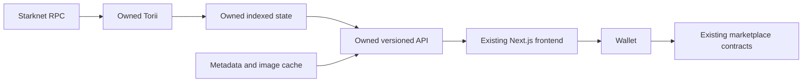

# Marketplace indexer: current state and replacement scope

Assessment date: 6 October 2026 (Australia/Sydney).

Subsequent decision: the user has chosen a custom Node.js indexer with no Torii. The recommendations below are preserved as the original assessment, not the current implementation direction. See the revised [backend scope](./BACKEND-SCOPE.md).

The user subsequently also chose new standalone Cairo trading contracts; see [contract scope](./CONTRACT-SCOPE.md). The retained-Arcade analysis below is historical context, not a current requirement.

Inspected `main` at `41059e990fbf44d16b132cd5249669250b539649` and draft PR #92 at `adbe683beb31ce3574497bd29b36c023a8f3f876`. This is a source and architecture assessment, not a production certification or an implementation change.

## Recommendation

Retain the frontend and initially retain the deployed marketplace contracts. Replace the hosted read infrastructure behind an owned API. Before writing another replacement, recover and validate the substantial implementation already in [draft PR #92](https://github.com/BibliothecaDAO/marketplace/pull/92).

The draft already takes this direction. It is not merged or demonstrably ready to operate: CI has failures, and checked-in tooling and runbooks do not establish that full replay, reconciliation, deployment, and lifecycle testing have succeeded. The next investment should be a bounded replay and deployment proof, followed by a decision about which parts of that draft to retain or simplify.

“Our own indexer” can mean operating open-source Torii with our own storage, RPC providers, API, and assets. It does not require writing a Starknet/Dojo decoder from scratch. Complete independence from Cartridge wallets, RPC, SDK, and contracts is a separate, larger scope.

## What exists on main

The application is a Next.js 16.1.6 / React 19.2.3 frontend using Tailwind, shadcn, TanStack Query, and Zustand. It pins `@cartridge/arcade` to `0.3.14-preview.1`. The inspected `src` tree contains 97 production TypeScript/TSX files, approximately 14,098 lines, and 53 test files. These counts describe size, not quality or correctness.

| Surface | Existing implementation | Treatment |
| --- | --- | --- |
| Discovery | Configured collections, home cards, featured collection and token section | Retain presentation; replace data access and aggregation |
| Collection browsing | Token grid, pagination, URL filter/sort state, trait facets, activity panels, sweep selection | Retain useful interaction logic; move authoritative querying and sorting behind API |
| Token detail | Metadata, ownership, listings, listing/offer/cancel forms, fee estimates | Retain UX; isolate reads and contract calls |
| Cart | Persisted selections, one currency, 25-item cap, stale-row errors, account multicall | Retain invariants; replace indexed validation and strengthen confirmation |
| Portfolio/profile | Arbitrary wallet lookup and collection-grouped holdings | Retain; replace balances and collection discovery |
| SEO | Server-side collection/token metadata and generated OG routes | Migrate server reads as well as browser reads |
| Diagnostics | SDK client status | Replace with actual indexer/API freshness and readiness |
| Testing | Unit/component suite, Playwright, CI and screenshot workflows | Retain; add deterministic data and chain lifecycle evidence |

Main has no owned indexer worker, database migrations, or marketplace data service. The README's general reference to API routes is not evidence of an implemented indexing backend. Route files mostly provide shells around feature modules. Some older scope/PRD documents describe earlier stages; actual code is the stronger inventory.

Sources: [package manifest](https://github.com/BibliothecaDAO/marketplace/blob/41059e990fbf44d16b132cd5249669250b539649/package.json), [feature tree](https://github.com/BibliothecaDAO/marketplace/tree/41059e990fbf44d16b132cd5249669250b539649/src/features), [README](https://github.com/BibliothecaDAO/marketplace/blob/41059e990fbf44d16b132cd5249669250b539649/README.md).

## Where Cartridge is embedded

There are 18 production source files importing Arcade. It is more than a provider at the top of the React tree.

| Dependency | Current path | Replacement requirement |
| --- | --- | --- |
| Orders/listings | Arcade hooks/client query `ARCADE-Order` in the default project | Reconstruct the World models and expose stable order queries |
| Marketplace settings | `ARCADE-Book` via `getFees()` | Index fee configuration and pause state with block provenance |
| Tokens and collections | SDK fetchers query collection-specific Torii projects | Index configured NFT contracts and metadata |
| Holdings | Token balance fetchers, including complete wallet pagination | Owned account/collection/token balance queries |
| Traits | Direct SDK summary/value SQL helpers | Owned facet counts and filter queries |
| Images | SDK constructs Cartridge Torii `/static/.../image` URLs | Owned cache/proxy and explicit metadata handling |
| SEO | Dynamically imported SDK on the server | Server-compatible owned API client |
| Checkout | Indexed listing reads plus direct contract validity and Arcade manifest access | Fresh indexed state plus direct-chain preflight |
| Wallets/RPC | Controller connector, Ready/Braavos, Cartridge Starknet RPC | Can initially remain; separate from indexer ownership |

The published pinned package hardcodes `https://api.cartridge.gg/x/{project}/torii` and defaults to `arcade-main`. Its public client configuration has chain, default project, image resolvers, RPC provider, and runtime, but no arbitrary Torii base URL. Passing a different RPC provider is not an indexer replacement. Several direct fetch helpers also bypass the React provider, so swapping that provider alone is incomplete.

I fetched and inspected the exact published package, including source maps. Its edge implementation queries orders/Book from the default project and uses collection projects for token/ownership data. Royalty lookup is a direct RPC capability, distinct from indexed fee configuration.

Sources: [read hooks](https://github.com/BibliothecaDAO/marketplace/blob/41059e990fbf44d16b132cd5249669250b539649/src/lib/marketplace/hooks.ts), [SEO reads](https://github.com/BibliothecaDAO/marketplace/blob/41059e990fbf44d16b132cd5249669250b539649/src/lib/marketplace/seo-data.ts), [wallet/RPC configuration](https://github.com/BibliothecaDAO/marketplace/blob/41059e990fbf44d16b132cd5249669250b539649/src/lib/marketplace/starknet-config.ts), [pinned npm archive](https://registry.npmjs.org/@cartridge/arcade/-/arcade-0.3.14-preview.1.tgz).

## Current availability observations

Read-only HTTP GET probes during this assessment returned:

| Address | Result |
| --- | --- |
| `https://api.cartridge.gg/x/arcade-main/torii` | 410 |
| `https://api.cartridge.gg/x/arcade-main/torii/graphql` | 410 |
| `https://api.cartridge.gg/x/arcade-main/torii/sql` | 410 |
| `https://marketplace-hde7.vercel.app` | 200 |

These establish endpoint responses at inspection time. They do not establish the live site's exact deployed commit, full browser functionality, or availability of every collection-specific project. Serving HTML is not proof that listings and portfolio reads work. The draft's July scope independently records the same default-indexer outage.

## Existing replacement: draft PR #92

The only open PR at inspection is **“feat: add owned marketplace indexer and read plane”**, created 14 July 2026. Its branch has three commits beyond main and changes 179 files, with 23,068 insertions and 3,006 deletions including lockfile changes.

This is real implementation code, not only a proposal:

| Area | Implemented in draft |
| --- | --- |
| Indexer | Torii 1.8.16 pinned by source commit, two local patches, Docker build, chain configs, audit SQL |
| API | Fastify service; versioned collections, tokens, orders/listings, holdings, traits, activity, Book, status, image and batch-order endpoints |
| Data contract | Shared runtime schemas, domain types, normalization and cursor code |
| Registry | Chain/deployment identities, start blocks, currencies, collection list and config generator |
| Frontend | Owned API client, hooks, SEO migration, rollout controls, checkout preflight and index confirmation |
| Write boundary | Arcade isolated in a write adapter instead of pervasive read dependencies |
| Operations | RPC qualification, replay comparison, reconciliation, load/soak/restore evaluators and release-evidence tooling |
| Hosting | AWS Terraform: networking, ECS API tasks, per-chain EC2/EBS Torii, CloudFront/WAF/ALB, recovery storage, telemetry and OIDC |

The registry lists seven mainnet ERC-721 collections: Realms, Season Pass, Loot Chests, Cosmetics, Golden Token, Beasts, and Adventurers. Sepolia has no registered NFT collection. Those are draft configuration values; their deployment identities and start blocks were not independently revalidated against chain in this assessment. Do not infer general ERC-1155 product readiness from generic indexer support.

The draft uses self-hosted Torii/SQLite, not a newly written custom indexer. Local Rust patches add metadata-fetch hardening and provenance/storage changes; maintaining that patched upstream is an ongoing responsibility. The AWS footprint should be justified against actual usage and operational capacity before accepting all of it.

Sources: [draft tree](https://github.com/BibliothecaDAO/marketplace/tree/adbe683beb31ce3574497bd29b36c023a8f3f876), [registry](https://github.com/BibliothecaDAO/marketplace/blob/adbe683beb31ce3574497bd29b36c023a8f3f876/config/marketplace/chains.json), [API implementation](https://github.com/BibliothecaDAO/marketplace/blob/adbe683beb31ce3574497bd29b36c023a8f3f876/services/marketplace-api/src/app.ts), [infrastructure README](https://github.com/BibliothecaDAO/marketplace/blob/adbe683beb31ce3574497bd29b36c023a8f3f876/infra/marketplace-data/README.md).

## What is and is not verified in the draft

GitHub reports the PR as draft/open with merge status `UNSTABLE`. On the inspected head:

- `node-contracts` passed.
- The main `verify` job failed on three expected CSS-class assertions in collection-sidebar, sidebar-layout, and collection-route-view tests. The PR describes these as pre-existing; I confirmed the reported assertion failures, but did not rerun both branches to establish their provenance independently.
- The infrastructure job failed at Checkov, with findings concerning access logging, IAM constraints, TLS and network/WAF policies. These require triage; a policy finding is not by itself a confirmed exploitable vulnerability.
- The container job failed during the combined API typecheck/test/build/deploy command. The available annotation does not isolate which subcommand caused it.
- The Terraform plan job was skipped. Vercel's status passed; that does not validate the indexing service.

The Torii image lock has `publishedImageDigest: null`. The deployment module deliberately requires release evidence before workload launch, and the README's populated evidence object explicitly identifies itself as an example. No actual replay/soak/restore report was supplied for this assessment. This does not prove that no external deployment exists; it means readiness cannot be established from the inspected evidence.

Sources: [main CI run](https://github.com/BibliothecaDAO/marketplace/actions/runs/29307247902), [data-plane CI run](https://github.com/BibliothecaDAO/marketplace/actions/runs/29307247933), [image lock](https://github.com/BibliothecaDAO/marketplace/blob/adbe683beb31ce3574497bd29b36c023a8f3f876/docker/torii/image.lock.json), [operating runbook](https://github.com/BibliothecaDAO/marketplace/blob/adbe683beb31ce3574497bd29b36c023a8f3f876/docs/runbooks/marketplace-data-plane.md).

## Correctness requirements that drive the scope

1. **Index the Dojo World, not only NFT transfers or sales events.** The pinned sell-order cancellation code changes the stored Order model without emitting a dedicated cancellation event. A generic sale-event scraper can leave cancelled listings active. Reconstruct Book, Orders, marketplace history, token transfers and balances.
2. **Use complete order identity.** Contract calls identify orders with `(orderId, collection, tokenId)`; storage and API identity should additionally include chain/marketplace context. Main's cart is keyed only by `orderId`; the draft introduces composite identity.
3. **Preserve numbers losslessly.** The pinned edge SDK converts order token IDs, prices and quantities into JavaScript numbers. The replacement should use strings across JSON and bigint for arithmetic, with tests above `2^53`.
4. **Make checkout conservative about stale data.** Require placed/unexpired order state, Book not paused, matching terms, seller ownership/approval, and bounded index lag. Direct `get_validity` is not a substitute for all of those checks: the inspected sell helper delegates asset/expiry validity without testing Order status or Book pause. Contract execution remains the final concurrency check.
5. **Distinguish transaction submission, chain acceptance and index convergence.** Main clears the cart and says “Purchase complete!” immediately after `account.execute` returns a transaction hash. The new flow needs accepted/reverted receipt handling and a read watermark before presenting converged indexed state.
6. **Keep currencies separate in analytics.** Main's home floor calculation compares raw prices across currencies, using a maximum 100-listing sample. “Trending” comes from up to 12 tokens in a randomly featured collection, sorted by price; it is not a market-wide volume ranking. Define per-currency floors, counts and sorting server-side rather than treating current labels as authoritative market statistics.
7. **Prove metadata and trait coverage independently of orders.** Images and mutable game attributes need refresh rules, fetch bounds and failure visibility. Replaying marketplace orders alone will not recover the storefront or holdings experience.

Sources: [sell-order component](https://github.com/cartridge-gg/arcade/blob/c0355bcd142627d06fb639fd7bf3ea8b57f80d64/packages/orderbook/src/components/sellable.cairo), [contract interface](https://github.com/cartridge-gg/arcade/blob/c0355bcd142627d06fb639fd7bf3ea8b57f80d64/contracts/src/systems/marketplace.cairo), [cart](https://github.com/BibliothecaDAO/marketplace/blob/41059e990fbf44d16b132cd5249669250b539649/src/features/cart/components/cart-sidebar.tsx), [home data](https://github.com/BibliothecaDAO/marketplace/blob/41059e990fbf44d16b132cd5249669250b539649/src/features/home/use-home-page-data.ts), [query limits](https://github.com/BibliothecaDAO/marketplace/blob/41059e990fbf44d16b132cd5249669250b539649/src/lib/marketplace/query-limits.ts).

## Recommended target and delivery sequence

Keep Torii SQL/admin interfaces private. The product API owns schemas, pagination, query limits, cache policy, assets and freshness. This boundary lets a later custom indexer replace Torii without rewriting the frontend again.

| Stage | Concrete output | Exit condition |
| --- | --- | --- |
| 1. Recover draft | Reproducible API/Torii builds; CI failures understood; current registry checked | A runnable local/staging stack with documented commands |
| 2. Prove indexing | Empty replay of World and one representative collection, then all supported collections | Book/orders, cancellations, owners, balances and traits reconcile; checkpoint/resume and deterministic rebuild demonstrated |
| 3. Prove product API | Contract tests against replayed data, per-currency filtering, assets, holdings and freshness | Existing route requirements satisfied without hosted reads |
| 4. Prove transactions | Registered Sepolia test collection and list/offer/cancel/buy lifecycle | Correct receipts and indexed convergence, plus stale/cancelled/paused checkout rejection |
| 5. Operate and cut over | Lag monitoring, backup/restore, RPC failover, load measurements, staged browse-to-checkout rollout | No hosted Torii/static requests; rollback to previous owned service or read-only mode works |

Treat the first 3–5 engineering days as a time-boxed viability investigation, not a promise that full historical replay will complete in that window. It should produce an explicit keep/simplify/replace decision on the draft and a credible remaining estimate. RPC history access, replay throughput and data discrepancies are the main unknowns.

The existing July scope estimated 4–6 calendar weeks with a data/platform engineer plus a frontend engineer for a greenfield version of this migration. That is historical planning guidance, not an estimate of remaining work now that the draft exists. A fresh remaining estimate should follow Stage 2.

## When starting again would make sense

| Option | Assessment |
| --- | --- |
| Finish/adapt PR #92 | Best starting point; it covers the identified read surfaces, subject to replay and operational proof |
| Fresh read service retaining frontend/contracts | Reasonable if the draft's infrastructure or patched Torii maintenance proves too costly; retain reusable schemas, tests and migration boundaries |
| Custom Starknet/Dojo indexer | Consider only after Torii fails a concrete requirement or its operating cost is unacceptable; must implement model mutation decoding, replay, recovery and metadata semantics |
| New frontend | No current evidence that this is needed to remove the indexer dependency |
| New marketplace contracts | Separate product/security decision involving liquidity, existing orders, approvals and migration; not necessary just to own indexing |

The draft ADR explicitly retains contract behavior and records an unresolved offer/client-fee risk. Its claim of accepted scope is repository documentation, not fresh authorization from the user. Revalidate contract identity and review that risk decision before enabling transactions; this assessment did not perform a new contract security audit.

Source: [retained-contract ADR](https://github.com/BibliothecaDAO/marketplace/blob/adbe683beb31ce3574497bd29b36c023a8f3f876/docs/adr/0001-retain-arcade-contracts.md).

## Evidence limits and remaining inputs

- Inspected source, exact npm artifact, relevant upstream Cairo, GitHub PR/check annotations and read-only endpoint responses.
- No application test suite, container build, historical replay, browser wallet flow or live transaction was run during this documentation-only assessment.
- No infrastructure account, production database, usage metrics, cost data, RPC plan or signed release evidence was inspected.
- Open product issues still include wallet connection persistence (#88), readable portfolio collection names (#87), and legacy Golden Token visibility (#86); these are distinct from indexer replacement and should remain visible in the backlog.
- Before implementation, establish whether the objective is hosted-indexer independence or removal of every Cartridge dependency; identify the intended production collection/network set, infrastructure owner and any existing PR #92 deployments or replay evidence.

No production state was changed. The repository was cloned locally and this assessment was added as a document.
